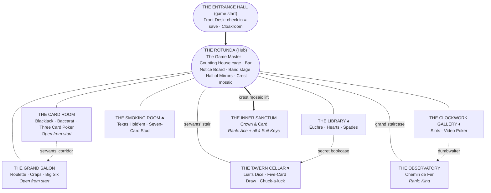
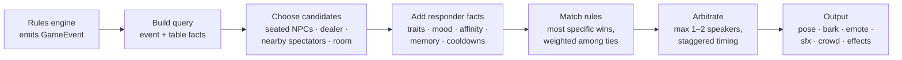
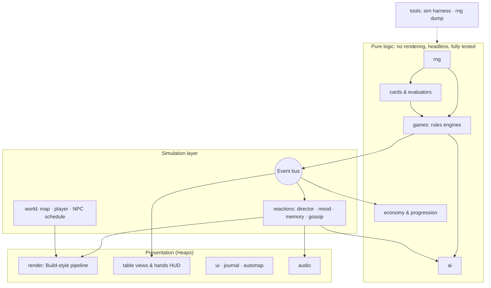
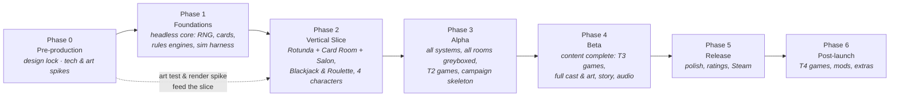

# Crown & Card: Master Game Design Document

| | |
|---|---|
| **Status** | Draft v0.2: design phase, no code yet |
| **Last updated** | 2026-09-27 |
| **Owner** | David Kendig |
| **Engine / Language** | Haxe + [Heaps](https://heaps.io) (HashLink native, WebGL) |
| **Genre** | First-person 2.5D social casino / card-game adventure |
| **Setting** | Dodriec Manor: the only location, always game night, no clock |
| **Look** | HD pixel art rendered through a Build-engine-style sprite pipeline |
| **Saving** | Check in with the front desk clerk at the manor entrance |

> This file is the single source of truth for the game's design. Code, art and data follow it. When a decision changes, update this doc first and record the change in the [Decision Log](#17-open-questions--decision-log).
>
> Sections marked **(DRAFT)** are proposals that still need sign-off. Sections marked **(LOCKED)** are agreed.

---

## Table of Contents

1. [Vision](#1-vision)
2. [Setting & Narrative](#2-setting--narrative)
3. [Core Loops & World Structure](#3-core-loops--world-structure)
4. [World & Level Design](#4-world--level-design)
5. [Art Direction: HD Pixel × Build Engine](#5-art-direction-hd-pixel--build-engine)
6. [The Games](#6-the-games)
7. [RNG & Fairness](#7-rng--fairness)
8. [Characters & the Reaction System](#8-characters--the-reaction-system)
9. [AI Opponents](#9-ai-opponents)
10. [Economy & Progression](#10-economy--progression)
11. [UX, UI & Accessibility](#11-ux-ui--accessibility)
12. [Audio](#12-audio)
13. [Technical Design](#13-technical-design)
14. [Development Roadmap](#14-development-roadmap)
15. [Feature Backlog (MoSCoW)](#15-feature-backlog-moscow)
16. [Risks & Mitigations](#16-risks--mitigations)
17. [Open Questions & Decision Log](#17-open-questions--decision-log)
18. [Glossary](#18-glossary)

---

## 1. Vision

### 1.1 Elevator Pitch

You've received an invitation: a blank playing card embossed with a gold crown. Behind it is **the Order of the Crown & Card**, a secret society that has met for game night for two hundred years. Check in at the front desk of **Dodriec Manor**, where it is always game night, and walk its candlelit halls in first person. Sit down at poker, blackjack, euchre, roulette and craps tables full of eccentric members who cheer, sulk, gossip and hold grudges over every hand you play. Climb the Order's ranks, collect the four Suit Keys, uncover the house's secrets, and earn a seat at the Crown's own table.

### 1.2 Design Pillars

| # | Pillar | What it means in practice |
|---|---|---|
| 1 | **Every Table Tells a Story** | Games are scenes, not menus. Characters react to *your* state (streaks, bluffs, busts, big pots) with poses, barks and grudges that last. |
| 2 | **Honest Games** | Authentic rules, real house edges, and an RNG we can prove is fair. The house never secretly adjusts outcomes. Cheating exists only as clearly-marked narrative that the player can catch. |
| 3 | **A House Full of Secrets** | Build-era level design joy: hidden passages, keys, secret rooms, collectibles, and a mystery to unravel. |
| 4 | **Old-School Look, Modern Comfort** | HD pixel art with a Build-engine feel, plus modern UX: pace controls, dealer walkthroughs, strategy helpers and strong accessibility options. |

### 1.3 Player Fantasy

*"I'm the mysterious new member who walked in with nothing, read the room, learned everyone's tells, broke the bank at the craps table, and ended up toasting at the Crown's side."*

### 1.4 Reference Touchstones

- **Visual / tech:** *Duke Nukem 3D*, *Blood* (its Victorian-gothic Build look), *Ion Fury* (hi-detail art in a real Build engine, our closest target), *Octopath Traveler* (HD-2D glow and depth of field, used sparingly).
- **Tone / setting:** *Knives Out* (eccentric cast in a manor), *Casino Royale* (high-stakes poker tension), *Clue/Cluedo* (a mansion of themed rooms), *The Great Gatsby* (party energy).
- **Gameplay:** *Red Dead Redemption 2* saloon games (in-world tables with characters), the *Yakuza / Like a Dragon* casino side games, *Inscryption* (first-person tabletop with a theatrical host).

### 1.5 Non-Goals

- **No real-money gambling:** no purchasable chips, no loot boxes, no wagering of any kind.
- **Not a shooter.** We borrow Build's look and level design, not its combat.
- **Not an open world.** One dense, handcrafted manor.
- **Not a strategy trainer that promises results.** We teach the rules and the odds honestly.

---

## 2. Setting & Narrative

### 2.1 The Order of the Crown & Card (DRAFT)

The Order is a society of nobles, card sharps, scholars and scoundrels. Its founding motto is **"Fortune favors the honest hand."** Its ranks are named after the cards (see §2.4). The Order is older than the manor it meets in. Its occult trappings (tarot, portraits of past Crowns, ritual toasts) sit under a Jazz Age party.

**Recommended era:** *"The Gilded Hour"*: a 1920s Art Deco party built on a Victorian-gothic manor. This lets each room have its own style (Deco card room, gothic library, clockwork gallery) while staying one coherent world. *(Open question Q1.)*

### 2.2 Dodriec Manor (LOCKED)

The whole game takes place inside the sprawling Dodriec Manor. You enter through the **Entrance Hall**, where the front desk clerk checks you in (this is how you save; §4.2). The public rooms fan out from a central rotunda. Servants' corridors, dumbwaiters, hidden stairs and a sealed sanctum beneath the floor link them in secret.

**The player is perpetually here.** It is always game night at Dodriec Manor. There is no visible clock, no end of night, and no tally screen. The lighting never changes on a timer, and the night sky outside the windows stays put. The NPC schedule (§3.2) and the metagame / ARG schedule (§3.4) run behind the scenes, but neither is ever presented as time passing.

### 2.3 The Player

- An anonymous initiate. You pick a **mask** (Venetian, animal, domino, plague-doctor, etc.) and attire in the cloakroom when you first check in. You can see both in mirrors.
- **Masks are half-masks for everyone.** Mouths and eyebrows stay visible, which keeps NPC expressions readable (an art-budget win).
- **Central hook:** *Who sponsored your invitation?* The answer is revealed when you reach Crown rank.

### 2.4 Rank Ladder

| Rank | Title | Grants |
|---|---|---|
| 0 | **Pip** (Initiate) | Rotunda, Card Room, Grand Salon. Low table maximums. |
| 1 | **Knave** | Higher table maximums. Can hold Suit Keys. |
| 2 | **Queen** | The Game Master arranges tournaments for you. Invitations to private games. |
| 3 | **King** | The Observatory (high-roller room). High table maximums. Loss rebates. |
| 4 | **Ace** | Eligible for the Inner Sanctum (requires all four Suit Keys). |
| 5 | **Crown** | Story finale. The manor carries on, and you keep playing as a Crown. |

You rank up by winning a **rank game** arranged by the Game Master (§3.3). The Game Master offers it once your Rep is high enough (§10.4). Your **signet ring** (visible on your first-person hands) changes with each rank.

### 2.5 Narrative Arc (DRAFT, intentionally light)

The campaign is split into **chapters, one per rank**. Each chapter has a goal (reach the next rank), a Suit Key or room to unlock, and one or two story beats. Story beats trigger from progress (rank-ups, keys, rooms), never from a clock. **The story advances only through games arranged by the Game Master** (§3.3). Free play at any table never advances it on its own.

| Chapter (rank) | Beats (draft) |
|---|---|
| **Pip** | Check in with Mr. Quill at the front desk. Pemberton's tour. Meet the Game Master and play your first arranged game. Rumors of a cheat. |
| **Knave** | The Game Master arranges the Professor's card-counting challenge, which yields the ♠ Spade Key. The Library opens, along with the Twins' suspicious euchre partnership. |
| **Queen** | The Game Master arranges a craps wager against the Colonel for the ♣ Club Key, then a poker tournament in the Smoking Room where Valentine Crake's rivalry peaks. A portrait with its face scratched out leads to the secret bookcase and the ♥ Heart Key. |
| **King** | Assemble the gears for the ♦ Diamond Key. The Clockwork Gallery and the Automaton's riddle. An arranged Chemin de Fer game in the Observatory. The sponsor's identity narrows. |
| **Ace** | With all four keys, the crest-mosaic lift opens the Inner Sanctum. |
| **Crown** | The Game Master arranges the Crown's game. The sponsor is revealed. |

**Subplots:** catching the cheating Twins, the Pit Boss versus the Professor, Madame Zelenka's prophecies, the missing member, and Valentine as rival-turned-ally or rival-turned-antagonist.

---

## 3. Core Loops & World Structure

### 3.1 Loops

| Loop | Duration | Content |
|---|---|---|
| **Micro** | 30 s – 3 min | Bet, play, outcome, **reactions**, next round. |
| **Mid** | 10 – 30 min | Free play at any table. Follow a rumor, explore for secrets, build Rep, manage the bankroll. |
| **Session** | Between check-ins | Play for a while, then walk back to the front desk to check in (save). |
| **Chapter** | Per rank | Talk to the Game Master, win the arranged games, unlock a Suit Key or room, rank up (§2.5). |
| **Meta** | Campaign | Ranks, Suit Keys, relationships, collections, cosmetics, mastering each game. |

### 3.2 No Visible Time: Events & the NPC Schedule

- **No visible clock and no end of night** (§2.2). No HUD element, menu, bark or visual ever tells the player what time it is.
- **Events trigger from progress and table state:** a toast at the bar when you rank up, a rumor on the Notice Board pointing you back to the Game Master, a band sting when a table gets hot, story beats when you unlock a key or room.
- **NPC schedule:** members follow a schedule that moves them between rooms and activities. Its timing isn't specified in this document. **It must never feel like a nightly clock:**
  - No time-of-night cues: no "it's getting late" or "early yet" barks, no closing time, no last call, and no lighting, music or crowd changes tied to the schedule.
  - Movement looks motivated by character, not by the hour: "Fancy a drink," "The dice are calling me," following a rival, chasing a hot table.
  - NPCs always finish the current hand or round before leaving a table.
  - Mood and boredom (§8.3) can cause short detours from the schedule.
  - The automap shows where you last saw each member.

### 3.3 Free Play & the Game Master (LOCKED)

The player never leaves Dodriec Manor, and there are **no selectable game modes**.

- **Everything is free play.** Walk up to any table, sit down and play, anytime.
- **One table per game type in each room.** No practice tables, no stakes tiers, no duplicate tables. Each table has one fixed rule set, shown on its placard.
- **Table limits follow your rank:** the minimum bet stays low, and the maximum rises as you rank up (§10.1).
- **Learning happens at the real table:** the first time you sit at each table, the dealer offers a short walkthrough of the rules. You can ask again anytime (§11.2).

**The Game Master** is the only way to advance the story. Talk to them in the Rotunda to set up an **arranged game**:

| Part of an arranged game | What it means |
|---|---|
| **Where** | The normal table for that game type. It's reserved for the arranged game while it runs, then returns to free play. |
| **Who** | Specific opponents or partners, e.g. the Colonel at craps or the Twins at euchre. |
| **Terms** | The stakes, the win condition ("win going alone", "last player standing"), and any special house rules. |
| **Prize** | Story progress: a rank-up, a Suit Key, a room, or a story beat. Rep and cosmetics for optional ones. |

- **Story games** move the chapter forward (§2.5). **Rank games** promote you (§2.4). **Optional side games** pay Rep and cosmetics.
- Which arranged games the Game Master offers depends on your rank, Rep and keys (§10.4).
- If you lose, talk to the Game Master again to set up a rematch.
- Tournaments are arranged games: single-table events at the normal table.
- After Crown, the story ends but the manor carries on, and the Game Master keeps offering side games.

### 3.4 Metagame / ARG Layer (separate document)

A scheduled metagame / ARG plot will be implemented. **Its schedule, plot and mechanics are designed in a separate document and are intentionally left out of this one.**

This doc only notes where it touches the systems described here. The separate document defines the actual integration:

- Like the NPC schedule, it is **never presented as a clock** (§2.2, §3.2).
- It will likely need hooks into the event bus (§13.2), the Reaction Director (§8.5), the NPC schedule (§3.2), the Game Master (§3.3), the Notice Board (§4.2), and check-in saves (§13.7).
- **Honest Games still applies** (§7.10). Nothing in the metagame may alter outcome RNG.

---

## 4. World & Level Design

### 4.1 Layout Overview



### 4.2 The Entrance Hall & The Rotunda (Hub)

**The Entrance Hall** is where every visit begins: a double-height grand manor foyer with marble floors, brass-trimmed burgundy walls and a ceremonial welcome desk. The player arrives in front of the desk, facing the hooded, robed Mr. Quill. A large water fountain stands behind him, followed by a grand staircase. Side aisles connect to the Rotunda. The staircase has real stepped floor heights for eventual second-floor access; removable velvet rope barriers keep it closed in the current build.

- **Departure:** approaching the grand front doors opens a translucent confirmation over the world. Stay cancels and returns control; Leave quits the game, without saving. A browser that cannot close its own tab stops the game and shows a departure screen. The door prompt rearms only after the player steps away.
- **Current check-in implementation:** interact with Quill using E / controller A to persist a local Guest Register checkpoint. Every visit starts at the welcome desk; the current render build records visit/check-in progress, with the full campaign payload added as those systems are implemented. Saving remains explicit, never automatic.
- **Entrance art:** generated burgundy damask / mahogany wall panels and brass-inlaid marble floor textures feed the palette renderer. The fountain is solid revolved 3D mesh geometry, with marble bowls, brass rims, water surfaces and animated falling streams; it is not a camera-facing sprite.
- **Card assets:** the standard deck has 52 individual 200 × 280 PNG faces (5:7 poker-card proportions) plus a matching back. Rank labels, suit shapes and pip counts are authored deterministically; generated masked court portraits and the ornamental back follow the manor palette. The Card Room table uses an authored blackjack layout.
- **Seated tabletop assets:** authored felt and brass/wood borders for Hold'em, five-card draw, Spades, Go Fish, Slapjack, War and Solitaire (`res/tabletops/`), palette-snapped at runtime. Blackjack retains its betting layout. The Mahjong art kit (`res/mahjong/`) includes 42 unique PNG faces, back, blank tile, and 136/144-tile manifests; Mahjong gameplay is not yet implemented.

- **The Front Desk:** Mr. Ambrose Quill, the front desk clerk, keeps the **Guest Register**. **Checking in with him is the only way to save** (§13.7). Loading a save puts you back at the front desk.
- **Greeting:** Quill greets you by name and rank, sometimes with a dry remark about your latest win or loss. There's no stats screen. Your records live in the Journal (§10.7).
- **The Cloakroom:** pick your mask and attire on first arrival, and change them later.

**The Rotunda** is a domed, two-story hall with a gallery balcony, one room from the front desk. It contains:

- **The Counting House:** the cashier cage. Buy-in, cash out and markers (loans).
- **The Bar:** Otto the bartender, drinks, gossip and rumors.
- **The Game Master:** arranges the games that advance the story (§3.3). Found at their own table in the Rotunda.
- **The Notice Board:** announcements and rumors. It often points you back to the Game Master.
- **The Band Stage:** a diegetic band with sprite musicians who play stings for big moments anywhere in the house.
- **The Hall of Mirrors:** Build-style mirrors that show your mask and attire. Also a cosmetics wardrobe.
- **Portrait Gallery:** past Crowns. Lore and clues. One portrait is scratched out.
- **The Crest Mosaic:** the floor emblem. It is secretly a sector-lift down to the Inner Sanctum (Build elevator homage).
- **Pemberton's Post:** your first tour, fast travel ("Shall I escort you, sir/madam?"), markers and favors.

### 4.3 Themed Rooms

| Room | Theme & mood | Games (launch) | Access |
|---|---|---|---|
| **The Card Room** | Art Deco, brass and green felt, cool jazz | Blackjack, Baccarat, Three Card Poker | Start |
| **The Grand Salon** | Chandeliers, gilded mirrors, big-band swing, loud crowds | Roulette, Craps, Big Six Wheel | Start |
| **The Library** ♠ | Gothic, leather and candlelight, hushed piano | Euchre, Hearts, Spades | ♠ Spade Key |
| **The Smoking Room** ♣ | Noir, cigar haze (translucent sprites), smoky blues | Texas Hold'em, Seven-Card Stud | ♣ Club Key |
| **The Clockwork Gallery** ♦ | Victorian machines, automatons, calliope music | Mechanical Slots, Video Poker | ♦ Diamond Key |
| **The Tavern Cellar** ♥ | Below-stairs staff party, folk fiddle, rowdy | Liar's Dice, Five-Card Draw (kitchen-table), Chuck-a-luck | ♥ Heart Key |
| **The Observatory** | Glass dome with a Build-style parallax night sky, celestial ambient | Chemin de Fer (one grand table under the dome, with VIPs) | Rank: King |
| **The Inner Sanctum** | Occult chamber, organ and choir | *Crown & Card* (signature game), finale | Rank: Ace + 4 keys |

**One table per game type in each room** (§3.3). Every table is free play, and its limits follow your rank (§10.1).

**Current build: the Card Room's card table.** Stepping up to the table and facing it shows a prompt. The prompt shows the **E** key on a keyboard, or the **green A** button on a controller, whichever the player last used. Pressing it opens the table's **game menu**, which offers every playable game: **Blackjack, Texas Hold'em, Five-card draw, Spades, Go Fish, Slapjack, War and Solitaire**. Choosing one seats the player at that game. The world pauses, dimmed, behind the seated view (§5.7). Leaving a game returns to the menu, and **Stand up** returns to the room. This single table stands in for the per-game tables until each room is built. Each game then moves to its room: Hold'em to the Smoking Room, draw to the Tavern Cellar, Spades to the Library.

### 4.4 Suit Keys (homage to Build's colored keycards) (DRAFT)

| Key | Opens | How it's earned |
|---|---|---|
| ♠ Spade Key | The Library | Win the Professor's blackjack challenge, arranged by the Game Master |
| ♣ Club Key | The Smoking Room | Win a craps wager against the Colonel, arranged by the Game Master |
| ♥ Heart Key | The Tavern Cellar | Find the secret bookcase passage (exploration) |
| ♦ Diamond Key | The Clockwork Gallery | Assemble 3 clockwork gears hidden in the manor |

Keys are **never gated by random outcomes**. Every key path is deterministic, based on skill or exploration.

### 4.5 Secrets & Collectibles

- **Secret areas**, counted per room and in total (*"Secrets found: 3/12"*): rotating bookcases, sliding panels, servants' hatches (crouch-crawl), the roof, the wine vault.
- **The Deck of Secrets:** 52 hidden playing cards scattered through the manor. Completing a suit unlocks a cosmetic card back. Completing the deck unlocks a lore ending.
- **Lore pages ("Ciphers"):** the Order's history, told through portraits, letters and ledgers.
- **Clockwork gears**, needed for the ♦ key.

### 4.6 Movement & Interaction

| Input | Action |
|---|---|
| WASD + mouse | Walk and look (controller supported) |
| Shift | Run. *Running in the manor earns disapproving looks* (etiquette) |
| Ctrl | Crouch: peek under tables, crawl through hatches |
| E | Use: doors, sit, talk, examine, pick up. On a controller: A. On-screen prompts show the E keycap or the green A button, following the device the player last touched |
| Tab | Automap |
| G | Gesture wheel: toast, tip, nod, shrug, applaud, taunt |
| Esc | Menu, or stand up from a table (between rounds) |

- **Interactables:** doors, tables and seats, the cage, the bar, the notice board, portraits, bookshelves, a phonograph (change the room's music), mirrors, the dumbwaiter, and NPCs (short talk menu: *Chat · Gossip · Invite to play · Challenge*).
- **Talk system:** barks plus small menus, not deep branching dialogue.
- **Jump:** not planned (manor decorum). Revisit if secret-area design needs it.

### 4.7 Automap

A Build-style automap overlay drawn like an **architect's floor-plan sketch** on parchment. It shows explored rooms, table types, current NPC locations (once you've met them) and found secrets.

---

## 5. Art Direction: HD Pixel × Build Engine

### 5.1 Definition of the Look (LOCKED: art style set 2026-09-27)

> **HD pixel art rendered through a Build-engine-style sprite pipeline.** The world is a 2.5D space of textured walls, floors and ceilings. Everything living in it (guests, dealers, props, smoke) is a crisp pixel-art **sprite** that snaps between drawn angles as you circle it, shaded by palette-based light tables. Picture *Blood*'s Victorian manor levels redrawn by a modern pixel artist at twice the detail, lit by candlelight.

**We keep the look, not the limitations.** Under the hood it's a real 3D renderer, so we get room-over-room, true depth sorting and no sprite clipping, while it still reads unmistakably as Build.

### 5.2 Resolution & Pixel-Grid Rules

- **Internal render height is fixed at 360 px.** Width follows the aspect ratio: 640×360 at 16:9, 576×360 at 16:10, 840×360 at 21:9.
- **Integer upscale** with nearest-neighbor sampling: 2× → 720p, 3× → 1080p, 4× → 1440p, 6× → 4K. Sharp-bilinear is used only when the scale isn't an integer.
- **One pixel grid:** everything in the world, the hands HUD and the table layer is drawn at internal resolution, so on-screen pixels are always the same size. No mixels.
- **Authored texel density:** **64 texels per meter** for environments and world sprites. A 1.75 m guest is about 112 px tall. At a 90° horizontal FOV, 1:1 viewing distance is about 5 m. Closer than that, texels grow chunky, which is the intended Build look.
- **Hero density (2×, 128 texels/m)** applies to seated NPC table poses and table props, which are seen up close. *The Phase 0 art test must validate these numbers.*

### 5.3 The Build-Style Sprite System

| Build feature | Our implementation |
|---|---|
| **8-direction rotation from 5 drawn angles** (front, front-¾, side, back-¾, back; the other 3 mirrored) | Default for all walking sprites. Asymmetric characters (eyepatch, one-sided sash) get all 8 angles drawn. |
| **Face sprites** (always face the camera, stay vertical) | Guests, dealers, candles, plants, smoke. Cylindrical billboards that never tilt with camera pitch. |
| **Wall sprites** (flat, aligned to a wall) | Paintings, posters, notices, wall sconces, the scratched-out portrait. |
| **Floor sprites** (flat, aligned to a floor) | Rugs, the crest mosaic, spilled chips, cards on tables (in the world view), light pools. |
| **Palette swaps** | Crowd guests reuse 3–4 base bodies, recolored plus swappable masks and hats. Dealers wear house colors per room. |
| **Sprite scaling** | Per-sprite scale for variety (tall and short guests), used sparingly. |
| **Animated tiles** | Fireplaces, candle flames, the slot-machine marquee, a flickering chandelier. |
| **Translucency (two levels, 33% / 66%)** | Cigar smoke, glass, ghostly portrait effects, the Observatory dome. |
| **Parallax sky** | The Observatory dome and the manor's windows. |
| **Mirrors** | The Hall of Mirrors and powder rooms. The player's own masked sprite is visible. |
| **Sector movers** | Sliding doors, the rotating bookcase, the crest-mosaic lift, the dumbwaiter, the Sanctum's rising table. |

**Angle selection:** `angleIndex = round((atan2(camToSprite) − spriteFacing) / 45°) mod 8`. Indices 5–7 mirror 3–1 horizontally. Sprites snap between angles and never interpolate. The snap *is* the effect.

### 5.4 Lighting & Palette Shading

- **Indexed-color pipeline (Build-authentic):** all textures and sprites are authored in a **master 256-color palette** (Aseprite indexed mode) and stored as 8-bit index textures. *Ion Fury* shows 256 colors is enough for hi-detail art. Revisit per-room palettes if it proves limiting.
- **Shade tables ("palookups"):** a LUT texture of **256 palette indices × 32 shade levels**. The shader resolves `color = shadeLUT[index, shade]`, which gives Build's characteristic banded falloff, including the "shade to black through hue shifts" look.
- **Per-area shade and visibility:** each room or area has a base shade and a *visibility* value (how fast things darken with distance). Candlelit library: dark and short. Chandeliered salon: bright and long.
- **Light sprites:** light sources lower the shade value in their radius. Flicker is animated by shade offsets.
- **Palette variants per room:** warm-candle, cool-moonlight and green-felt tints, applied as alternate LUT sets (like Build's per-sector palettes).
- **Optional ordered dithering** between shade steps (a setting). Off by default.
- **Modern touches, applied at internal resolution to protect the pixel grid:** soft bloom on flames and chandeliers, depth-of-field blur on the room behind you when seated (the HD-2D nod).

### 5.5 Camera

- **Y-shearing look up and down** by default, the authentic Build feel. Toggle to true perspective pitch in settings (comfort).
- **Look range: 75° up and 75° down.** Y-shearing covers Build's own range (about 31°), and past that the camera really pitches. Shearing further smears the image, so this keeps the Build feel for everyday glances while still letting the player look straight up at a dome or down at the floor.
- Head bob and hand sway, with a slider down to 0.
- FOV slider (default 90° horizontal).
- **Seated:** the camera locks to the seat and eases in to a narrower FOV. Mouse free-look is limited to a cone so you can glance at the people around you.

### 5.6 First-Person Hands (the "weapon sprite")

Your hands are HUD sprites at the bottom of the screen, just like Duke's weapons. They sway with walking and bob with breathing.

| Context | Hands |
|---|---|
| Walking | Empty, or holding a drink, cigar holder or lucky charm (cosmetic) |
| Using | Reach out to open doors, pick up cards, knock on panels |
| Poker / trick-taking | **Hold your hand of cards up, fanned.** Peek at hole cards with a lift gesture. |
| Betting | Push chip stacks. Tap the felt to check. Wave off to stand. |
| Craps | Shake and throw the dice |
| Baccarat | **Squeeze** the card slowly on big bets (a tension mini-interaction) |
| Slots | Pull the lever |
| Cosmetics | Gloves, the rank signet ring, card protectors |

### 5.7 The Seated Table View (DRAFT: validate in Phase 0 spike)

**Rule: readability beats purity.** Any card the player must read is drawn crisp at 1:1 internal pixels.

**Proposed hybrid:**

1. **Background:** the live 3D room (other tables and crowd) behind a slight depth-of-field blur, with seated NPCs as hero-density billboards across the table.
2. **Felt layer:** a screen-space pixel-art tableau per game family and seat, with the table surface drawn in baked perspective. The seated camera looks down steeply enough (~50–60°) that one card atlas drawn "at felt angle" works for all felt cards.
3. **Hands layer:** held cards and chip pushes (§5.6).
4. **UI layer:** bet spots, totals, the action bar, and an optional "table summary" strip for accessibility.

**Rotating pixel art** (the roulette wheel, Big Six) uses pre-rendered rotation frames, or RotSprite-style rotation baked at build time. Never live arbitrary rotation, which shimmers.

### 5.8 Character Art Spec & Budget (estimates)

| Set | Density | Angles | Frames (approx.) |
|---|---|---|---|
| World idle | 64 t/m | 5 drawn → 8 | 4 × 5 = 20 |
| World walk | 64 t/m | 5 drawn → 8 | 8 × 5 = 40 |
| World talk gesture | 64 t/m | 2 | 8 |
| Table body poses (idle, lean-in, recoil, slump, drink, arms-up) | 128 t/m | 3 drawn (front, ¾, profile) → 5 | ~6 poses × 3 frames × 3 = ~54 |
| Table expressions, as a **paper-doll head overlay** (happy, ecstatic, annoyed, furious, shocked, smug, thinking, bored, tipsy) | 128 t/m | 3 | ~9 × 2 × 3 = ~54 |
| Tells (1–3 per poker NPC) | 128 t/m | 3 | ~4 × 3 × 2 = ~24 |
| Dialogue portrait (screen-space, 96×96) | 1:1 | 1 | 6–8 expressions |
| **Total per main character** | | | **~200 frames** |

**Cost savers:** mirrored angles, head overlays instead of full-body redraws per expression, front-only dealers, palette-swapped crowd, and modular masks and hats.

### 5.9 Environment Art Spec

- Wall and floor textures at 64 texels/m. Typical tiles 64×64, 128×128 or 128×192 (a 3 m wall).
- A **modular kit per room theme:** walls, trim, doors, windows, and 20–40 props.
- Tables are room-specific props (blackjack arc, craps tub, roulette layout, round poker table, card table).

### 5.10 UI & Fonts

- Pixel fonts: a Deco display face, a readable body face, and a card-index face.
- Diegetic where possible: brass plaques, table placards, notice cards, the parchment automap.
- An optional **"HD text"** setting renders body text at native resolution for readability.

### 5.11 Post-Effects (all optional)

CRT/scanline filter, vignette, film grain, bloom, and seated depth-of-field. All toggleable. Defaults are tasteful and subtle.

---

## 6. The Games

### 6.1 Shared Table Framework

Every game sits on a common framework:

- **Free play:** there is one table per game type in each room, open anytime (§3.3).
- **Fixed rules per table:** each table has one rule set, shown with payouts and house edge on a brass placard. The rules engines support common variants so that the Game Master's **arranged games** can change the terms. Players never pick a variant.
- **Seats:** pick an open seat. Seat position matters for some etiquette (for example, blackjack's "third base").
- **Buy-in:** convert Sovereigns to chips at the table or at the cage. **Color up** when leaving.
- **Limits:** the minimum bet stays low, and the maximum follows your rank (§10.1).
- **Betting UI:** pick a chip denomination (number keys or wheel), click a bet spot, right-click to remove. **Rebet** and **Double rebet**.
- **Dealing presentation:** a speed setting (Relaxed / Brisk / Instant) and skip-animation.
- **Dealer tipping:** a gesture. Improves dealer affinity. Purely social, never changes outcomes.
- **Leaving:** only between rounds. Walking away mid-hand forfeits the hand and costs etiquette.
- **Arranged games:** the table is reserved while the Game Master's game runs, then returns to free play.

### 6.2 Game Families (shared engines control scope)

| Family | Shared engine | Games |
|---|---|---|
| **Banking cards** | Shoe, cut card, discard tray, dealer-vs-seats flow | Blackjack, Baccarat, Chemin de Fer, Three Card Poker, *(post: Spanish 21, Caribbean Stud, Let It Ride, Pai Gow)* |
| **Wheels** | Choreographed spin, layout betting | Roulette, Big Six |
| **Dice** | Choreographed throws, dice presentation | Craps, Chuck-a-luck, Liar's Dice, *(post: Sic Bo)* |
| **Poker** | Hand evaluator, betting rounds, pots & side pots, showdown | Texas Hold'em, Seven-Card Stud, Five-Card Draw, *(post: Omaha)* |
| **Trick-taking** | Deal, bidding, trick play, scoring | Euchre, Hearts, Spades, *(post: Whist, Bridge)* |
| **Machines** | Reel strips, paytables, hold/draw | Mechanical Slots, Video Poker |
| **Signature** | Custom | *Crown & Card* |
| **Parlour** | Small standalone engines (no betting) | Go Fish, Slapjack, War, Solitaire |

### 6.3 Game Catalog & Priority Tiers

| Game | Room | Family | Players | AI load | Tier |
|---|---|---|---|---|---|
| Blackjack | Card Room | Banking | 1–7 vs dealer | Low | **T1 (slice)** |
| Roulette | Card Room table *(current build)* | Wheels | 1 vs house | None | Added 2026-09-28 |
| Texas Hold'em | Smoking Room | Poker | 2–9 | **High** | T2 (alpha) |
| Craps | Card Room table *(current build)* | Dice | 1 vs house | None | Added 2026-09-28 |
| Euchre | Library | Tricks | 4 (partners) | Med–High | T2 |
| Baccarat | Card Room | Banking | 1–14 vs house | None | T2 |
| Hearts | Library | Tricks | 4 | Med | T3 (launch) |
| Spades | Library | Tricks | 4 (partners) | Med | T3 |
| Seven-Card Stud | Smoking Room | Poker | 2–8 | High | T3 |
| Five-Card Draw | Tavern Cellar | Poker | 2–6 | Med | T3 |
| Three Card Poker | Card Room | Banking | 1–6 vs dealer | None | T3 |
| Chemin de Fer | Observatory | Banking | 2–12 | Low–Med | T3 |
| Video Poker | Clockwork Gallery | Machines | 1 | None | T3 |
| Slots | Card Room table *(current build)* | Machines | 1 | None | Added 2026-09-28 |
| Liar's Dice | Tavern Cellar | Dice | 2–6 | Med | T3 |
| Big Six Wheel | Grand Salon | Wheels | 1–8 | None | T3 |
| Chuck-a-luck | Tavern Cellar | Dice | 1–6 | None | T3 |
| *Crown & Card* | Inner Sanctum | Signature | 4 | Med–High | T3 |
| Go Fish | Card Room table *(current build)* | Parlour | 4 | Low | Added 2026-09-28 |
| Slapjack | Card Room table *(current build)* | Parlour | 4 | Low (reaction times) | Added 2026-09-28 |
| War | Card Room table *(current build)* | Parlour | 2 | None | Added 2026-09-28 |
| Solitaire (Klondike) | Card Room table *(current build)* | Parlour | 1 | None | Added 2026-09-28 |
| Gin Rummy | Card Room table *(current build)* | Rummy | 2 | Med | Added 2026-09-28 |
| Canasta | Card Room table *(current build)* | Rummy | 4 (partners) | Med | Added 2026-09-28 |
| Bridge | Card Room table *(current build)* | Tricks | 4 (partners) | High | Added 2026-09-28 |
| Egyptian Rat Screw | Card Room table *(current build)* | Parlour | 4 | Low (reaction times) | Added 2026-09-28 |
| Durak | Card Room table *(current build)* | Beating | 2 | Med | Added 2026-09-28 |
| Omaha, Whist, Cribbage, Sic Bo, Pai Gow, Caribbean Stud, Let It Ride, Spanish 21, Bagatelle | various | various | | | T4 (post-launch) |

> **Scope guard:** 18 launch games is ambitious. The **minimum viable launch** is T1 + T2 + Hearts, Spades, Video Poker, Chemin de Fer and *Crown & Card* (11 games). Every room keeps at least one table. The rest can slip to post-launch.

### 6.4 Per-Game Specs (summary; each game gets its own spec doc in `docs/games/` during its phase)

**Blackjack**
- Table rules: 6 decks, dealer stands on soft 17, double after split, late surrender, insurance, dealer peek. **Blackjack always pays 3:2.**
- *Implemented (`games.blackjack`):* double on any two cards; split any two ten-value cards; split to four hands; split aces get one card each and can't be resplit; a 21 after a split pays 1:1. Bets run 2–50 Sov in even amounts, so 3:2 and half-bet insurance always pay in whole Sovereigns. The seated view deals cards one at a time in true deal order, and the hole card flips when the dealer plays. The player plays alone against the dealer for now; the NPC seats come with §9.4.
- Continuous shoe with a cut card at ~75% penetration, so **card counting genuinely works**. The Pit Boss's "heat" system responds (§8.8).
- Seven seats. NPCs play basic strategy with personality deviations.
- Post-launch: side bets (Perfect Pairs, 21+3).

**Roulette**
- Table rules: single-zero European wheel with French La Partage on even-money bets.
- Inside bets: straight, split, street, corner, six-line, basket. Outside bets: dozens, columns, even-money.
- French call bets (voisins, tiers, orphelins) with a racetrack UI.
- Croupier "no more bets" timing, the dolly marker, and a number-history board that feeds NPC superstitions about hot and cold numbers.
- *Implemented (`games.roulette`):* the full bet set above is in the rules engine and covered by `RouletteTest`, including La Partage. The seated table (still at the Card Room, pending the Grand Salon) offers straight-up numbers on a real 0-36 layout grid plus every outside bet; split/street/corner/six-line/basket wait on a mouse-driven racetrack UI. Bets sit on the felt and don't leave the purse until the wheel spins; the wheel itself is shown landed, not choreographed yet.

**Craps**
- Pass/Don't Pass, Come/Don't Come, Odds (3-4-5×), Place, Field, Big 6/8, Hardways, Props (Any 7, Any Craps, Yo, Horn, Hi-Lo).
- **Shooter rotation:** when the dice reach you, you throw them. The flick gesture controls only the animation; the RNG decides the outcome.
- The stickman calls the game ("Yo-leven!"). Hot rolls draw a crowd.
- **Dice etiquette:** don't say "seven", keep hands clear, the dice must hit the back wall. "Dark side" (Don't Pass) bettors get side-eye.
- *Implemented (`games.craps`):* Pass/Don't Pass and Come/Don't Come with 3-4-5x odds, Field, Place (4, 5, 6, 8, 9, 10), Hardways (4, 6, 8, 10), and the props Any Seven, Any Craps, Yo and Hi-Lo, all covered by `CrapsTest`. Big 6/8 and Horn aren't modeled: Place already covers 6 and 8 on better terms, and Horn is just Any Craps plus Yo bet separately. The seated table (still at the Card Room, pending the Grand Salon) walks the bet menu one family at a time rather than a mouse-driven layout; the dice are shown resolved, not tumbling.

**Baccarat (Punto Banco)**
- Full automatic third-card tableau, 5% Banker commission tracking.
- **Scoreboards:** bead plate and big road. NPCs chase patterns (gambler's-fallacy flavor).
- The **squeeze** on big bets.

**Chemin de Fer (the Observatory)**
- The aristocrats' baccarat: players take turns holding the bank, and the bank passes around the table.
- Players make some drawing decisions themselves, which gives NPC personalities room to show.
- One grand table under the dome, with the Order's VIPs.

**Texas Hold'em**
- Table rules: No-Limit cash game. Side pots and all-in run-outs. Show-or-muck choice.
- **Tournaments** are arranged by the Game Master and played as single-table events at this table.
- Hand history viewer.
- **Tells** (§8.9), table-talk barks, bad-beat reactions.
- The Society takes no rake.

**Seven-Card Stud / Five-Card Draw:** reuse the poker engine. Five-Card Draw is the kitchen-table game in the Tavern Cellar, with loose, rowdy NPCs.

*Implemented poker (`games.poker`):*
- **Engine:** one no-limit engine for both games, with full and short all-in raises (a short all-in doesn't reopen the betting), main and side pots, and odd chips going to the first winner clockwise from the button. A 5-to-7-card evaluator settles every showdown.
- **Hold'em:** blinds 1/2, heads-up blinds handled.
- **Five-card draw** follows [Pagat](https://www.pagat.com/poker/variants/5draw.html): ante 1, the first round starts left of the dealer, and each player exchanges up to three cards. The second round starts with the opener. If everyone checks the first round, the deal is thrown in and the pot carries over.
- **Buy-in:** 100 Sovereigns from the purse. Leaving mid-hand folds, and the stack returns to the purse. NPCs who go broke buy back in.
- **AI (§9.2, Normal):** Monte Carlo equity against the live opponents' unknown cards, weighed against pot odds and shaded by a looseness/aggression style per character. The Deacon is tight, the Colonel bold, Crake aggressive, and Reggie a loose, passive fish.

*Parlour games (`games.parlour`), rules per [Bicycle Cards](https://bicyclecards.com/how-to-play/) with house rules where the printed rules are silent:*
- **Go Fish:** 5 cards each for four players. Drawing the rank you asked for keeps your turn ("fish your wish"). The NPCs remember who asked for what.
- **Slapjack:** real-time slaps. NPC reaction times come from the AI stream: Tuppence fast, Reggie slow, and Reggie sometimes slaps a queen or king by mistake. House rules: slapping your own card puts it under the center pile, and if every card ends up in the center with no jack on top, the center is reshuffled and dealt back out.
- **War:** one card down and one up per war. House rule: a player who runs short in a war turns up their last card, and one with none left loses. Auto-play is available.
- **Solitaire (Klondike):** turn one card at a time, unlimited passes through the stock, and foundation cards may come back down. Auto-finish runs once nothing is hidden.

**Euchre**
- 24-card deck (9–A), right and left bowers, order up/pass, going alone, points to 10.
- Table rules: stick the dealer.
- The NPC partner follows standard conventions ("next", leading trump to a partner who called).
- **The Twins cheat by signaling.** The player can spot and report them (§2.5).
- *Implemented (`games.euchre`):* the player (South) partners Colonel Blythe (North) against the Vasquez twins. Bower-aware `effectiveSuit`/`power` drive both following suit and trick strength; stick-the-dealer is enforced (`passBid2` throws if the dealer tries to pass with no bid up). Signal-spotting (§2.5) isn't wired in yet. Seated at the Card Room table pending the Library.

**Hearts:** passing rotates left, right, across, then hold. Shoot the moon.
- *Implemented (`games.hearts`):* four-hand, no partnerships. Passing cycles Left/Right/Across/Hold by hand number; the held hand skips passing entirely. Must open the first trick with the two of clubs, must follow suit, and hearts can't be led until broken (or led because nothing else is held). Shooting the moon (all 26 points in one hand) swings 26 points onto everyone else instead of scoring the shooter. Seated at the Card Room table pending the Library.

**Gin Rummy**
- *Implemented (`games.rummy.GinRummy`):* heads-up against the Colonel. `evaluate()` finds the highest-value melding of a hand (3–4 of a rank, or a same-suit run of 3+, ace low with no wrap past king) by bounded backtracking over candidate sets and runs, then sums the rest as deadwood. Knocking needs 10 deadwood points or less; gin (0 deadwood) blocks the opponent from laying off and adds a 25-point bonus. An undercut (the opponent's deadwood is equal to or lower than the knocker's) flips the score to the opponent, +25. First to 100 wins.

**Canasta**
- *Implemented (`games.canasta.Canasta`):* the player partners the Colonel against a single NPC opponent (deliberately two-handed, not the traditional four). Deliberately simplified scope: no jokers (the card model has no joker card), so only the deuces are wild; no red-three bonus or black-three freeze mechanics, no frozen pile. A meld needs at least as many naturals as wild cards; a canasta is any 7+ card meld (500 points natural, 300 mixed) and going out requires having made at least one. Taking the discard pile needs two natural matches for its top card, or an existing meld of that rank to lay it on.
- *UI note:* `CanastaTableUI` is menu-driven rather than a card-fan, given scope — melding only offers whole natural-rank groups, not partial or wild-assisted selection through the UI (the engine supports more than the UI currently exposes).

**Bridge**
- *Implemented (`games.bridge.Bridge`):* the player partners the Colonel against the Vasquez twins, deliberately simplified (real Bridge is post-launch scope per §6.3's T4 list; this is a playable core, not tournament rules). The auction bids a level (1–7) and a strain — clubs, diamonds, hearts, spades, no-trump, ascending — or passes; three passes after a bid closes the auction, four with no bid throws the hand in. No doubling, redoubling, conventions or vulnerability. Whoever named the final bid declares; their partner's hand is the dummy, and the declarer plays both hands (`controllerOf`). Scoring keeps the trick-point scale (20/30 a trick, +10 first trick at no-trump) plus a flat 50-point game bonus, or 50 a trick to the defense for a set contract — no slam or rubber bonuses. First to 700 wins.

**Egyptian Rat Screw**
- *Implemented (`games.parlour.EgyptianRatScrew`):* four players (the house rules noted below follow [Bicycle Cards](https://bicyclecards.com/how-to-play/egyptian-rat-screw)). Face cards challenge the next player to beat it within a number of chances (ace 4, king 3, queen 2, jack 1); running out of chances or cards hands the whole pile to the challenger. Any player may slap for doubles, a sandwich (top and third-from-top match), top-bottom (top matches the pile's very first card), or a marriage (king/queen on top); a wrong slap burns a card to the bottom either way, and a player out of cards can still slap back in. Playing cards is turn-based; slapping is real time, timed off the AI stream like Slapjack.

**Durak**
- *Implemented (`games.durak.Durak`):* heads-up against Sir Reggie, Podkidnoy rules. 36-card deck (6–A), 6 cards each, trump is the last card cut. The attacker plays, the defender beats it (same suit and higher, or any trump) or takes the whole table; while undefeated, the attacker may pile on more cards matching any rank already on the table, up to six or the defender's starting hand size. Once the stock runs out, hands stop refilling and the first to empty their hand is safe; both emptying at once is a draw.
- *UI note:* `DurakTableUI` allows one open attack pair at a time rather than real Durak's simultaneous multi-card throws — a deliberate simplification of the UI, not the engine.

**Spades:** partnerships, bidding, nil and blind nil, sandbags.
- *Implemented (`games.spades`):* the player (South) partners Prof. Oyelaran (North) against the Vasquez twins, Rosalind (West) and Rafe (East). Deal and bidding rotate left.
- **Bidding:** bids run 0–13; 0 is nil. Blind nil is offered before you see your cards, only while your side trails by 100 or more.
- **Play:** follow suit. Spades can't be led until broken, unless you hold nothing else.
- **Scoring:** a made bid scores 10 per trick plus 1 per bag; a set loses 10 per trick bid. Every 10 bags costs 100. Nil scores ±100 and blind nil ±200. A nil bidder's tricks don't count toward the partner's bid; they're bags.
- **Game:** first to 500 wins. A side at −200 loses. Leaving mid-game abandons it.
- **AI:** the other three seats play Normal-level heuristics (§9.3) with card tracking: covering a partner's nil, ducking bags once the bid is made, and second hand low, third hand high.

**Three Card Poker:** Ante/Play and Pair Plus. Post-launch: 6-Card Bonus.

**Video Poker:** one machine, Jacks or Better (9/6). Optional optimal-hold hint.

**Mechanical Slots:** one Victorian three-reel one-armed bandit. Authored reel strips with virtual-reel weighting to a target RTP. **Its RTP is engraved on a brass plaque** (the Honest Games pillar).
- *Implemented (`games.slots`):* a single machine, three identical 33-stop reel strips (Crown, Seven, Bell, Bar, the four suits, Cherry and Blank), one payline. The RTP is exact (94.47%), not sampled: the strip is short enough that `SlotsTest` brute-forces every one of its 33³ equally likely stops. Seated at the Card Room table pending the Clockwork Gallery.

**Liar's Dice:** cups, hidden dice, bidding and challenges. Heavy on bluffing and reactions.

**Big Six / Chuck-a-luck:** simple, loud, crowd-pleasing games with a high house edge. NPCs love them.

**Crown & Card (signature game, design TBD in Phase 3):** two concept pitches.
- **(a)** A 4-player trick-taking game with secret bids and a hidden "Crown" trump suit that only the Crown-holder knows. The others deduce it from play.
- **(b)** A poker/bluffing hybrid where each round's "Crown card" rewrites one rule.

### 6.5 Definition of Done (per game)

- [ ] Rules engine: pure, deterministic, supports the table's rules plus common variants for arranged games
- [ ] Unit tests cover every rule and payout
- [ ] Simulation: realized RTP matches theory within a 99.9% confidence interval (§7.9)
- [ ] AI (if needed) at Easy, Normal and Hard
- [ ] Seated table view: felt, hands, UI, animations
- [ ] Reaction hooks emit all relevant events (§8.5)
- [ ] Dealer walkthrough, rules placard and strategy helper
- [ ] Accessibility pass: four-color deck, text summary, remappable keys
- [ ] Audio: shuffle/deal/chip foley, dealer or stickman calls

---

## 7. RNG & Fairness

The RNG is foundational. It must be **statistically excellent, reproducible, unbiased, and provably fair**, and it must behave identically on every build target.

### 7.1 Requirements

1. **Quality:** passes the PractRand and TestU01 BigCrush statistical batteries.
2. **Unbiased derivation:** every range, float, shuffle and weighted pick is mathematically unbiased.
3. **Enough state for every shuffle:** 52! ≈ 2^225.6. The outcome RNG needs **more than 226 bits of state**, or some deck orderings can never occur.
4. **Independent streams:** cosmetic randomness (particles, idle animations) must never shift game outcomes.
5. **Deterministic and serializable:** the same seed gives the same results on HashLink and JS. State is saved with the game.
6. **Unpredictable:** seeded from OS entropy. Players can't reverse-engineer the next card.
7. **Fast enough:** trivially met. We draw at most a few thousand numbers per second.

### 7.2 Architecture: Two Tiers

| Tier | Algorithm | Used for | Saved? |
|---|---|---|---|
| **Outcome RNG** | **ChaCha20** (RFC 8439 block function) used as a stream generator | Shuffles, dice, wheels, reels, AI mixed strategies, reactions with gameplay effects, NPC schedule detours | Yes |
| **FX RNG** | **xoshiro128\*\*** (seeded from the outcome tier) | Particles, idle animation offsets, bark text variation, crowd shuffle | No |

**Why ChaCha20:**
- It uses only **32-bit add, XOR and rotate**, which maps cleanly onto Haxe `Int` on every target (no slow 64-bit emulation, unlike PCG64 or xoshiro256).
- It is cryptographically strong, so the next card can't be predicted.
- Its 256-bit key comfortably exceeds the 226 bits needed for all 52! deck orderings.
- It has built-in **random access** (block counter) and **stream separation** (nonce).
- Official test vectors (RFC 8439) make correctness verifiable on every target.
- Speed is irrelevant at our draw rates. ChaCha12 or ChaCha8 are fallbacks if profiling ever says otherwise.

**Why xoshiro128\*\* for FX:** tiny, very fast, 32-bit native, and passes BigCrush. Its 128-bit state is fine for cosmetics but **must never shuffle a deck**.

**Never** use `Std.random()` or `Math.random()` in game code. CI enforces this with a grep-based lint.

### 7.3 Stream Layout

```
Profile master key (256-bit, from OS entropy, stored in save)
 ├─ table/<room>/<table>/shuffle     → shoe and deck shuffles
 ├─ table/<room>/<table>/outcome     → dice, wheel pockets, reel stops
 ├─ ai/<characterId>                 → bluff frequency, mixed strategies
 ├─ reactions                        → reaction picks that affect mood/affinity
 ├─ world                            → NPC schedule detours, crowd spawns
 └─ fx  (xoshiro128**, not saved)    → particles, idle anims, bark variants
```

**Stream derivation (`fork(label)`):** the child key is the first 8 words of the ChaCha20 block function under the parent key, with the nonce derived from a hash of the label. This is deterministic and **independent of creation order**: the craps table's stream doesn't change depending on whether you visited blackjack first.

### 7.4 Cross-Target Determinism in Haxe

- On HashLink and C++, `Int` is 32-bit and wraps. **On JS it does not wrap automatically on `+` and `*`.**
- All RNG and rules math uses `haxe.Int32` (or explicit `| 0` wrapping) plus `>>>` for unsigned shifts.
- **CI determinism test:** generate 1M outputs from a fixed seed on HL and JS, hash both, and assert equal.
- No floating point in outcome-critical paths. Floats are derived only at the edges (§7.5).

### 7.5 Deriving Values Correctly

```haxe
/** Outcome-grade random source. All gameplay randomness goes through this. */
interface IRng {
  function nextU32():Int;                    // 32 random bits
  function below(bound:Int):Int;             // unbiased integer in [0, bound)
  function between(lo:Int, hi:Int):Int;      // unbiased integer in [lo, hi]
  function nextFloat():Float;                // [0, 1) with 53 bits of precision
  function chance(p:Float):Bool;
  function shuffle<T>(items:Array<T>):Void;  // Fisher–Yates
  function pickWeighted<T>(items:Array<T>, weights:Array<Int>):T; // integer weights
  function fork(label:String):IRng;          // independent child stream
  function saveState():RngState;
}
```

- **Integers in a range:** bitmask with rejection, which is unbiased and needs no 64-bit math.
  ```haxe
  function below(bound:Int):Int {            // requires 0 < bound <= 0x7FFFFFFF
    var mask = bound - 1;
    mask |= mask >>> 1; mask |= mask >>> 2; mask |= mask >>> 4;
    mask |= mask >>> 8; mask |= mask >>> 16;
    var x:Int;
    do x = nextU32() & mask while (x >= bound);
    return x;
  }
  ```
  **Never use `nextU32() % n`**, which introduces modulo bias.
- **Floats:** 53-bit doubles built from two draws (`((a >>> 5) * 2^26 + (b >>> 6)) / 2^53`.
- **Shuffle:** Durstenfeld's Fisher–Yates only. Never sort by a random key.
  ```haxe
  function shuffle<T>(a:Array<T>):Void {
    var i = a.length;
    while (i > 1) {
      var j = below(i);
      i--;
      var t = a[i]; a[i] = a[j]; a[j] = t;
    }
  }
  ```
- **Weighted picks** (slot reels, AI choices): integer weights with cumulative table plus `below(total)`. No float accumulation.

### 7.6 Entropy & Seeding

- A small `Entropy` abstraction per target:
  - **JS:** `crypto.getRandomValues`.
  - **HashLink native:** a tiny native extension calling `BCryptGenRandom` (Windows), `getrandom` (Linux) or `SecRandomCopyBytes` (macOS).
- New profiles get a fresh 256-bit master key. Seeds are logged in debug builds for bug reproduction.

### 7.7 Outcome First, Animation Second

Physics never decides outcomes. The RNG decides first, then the presentation is **choreographed** to match:

- **Cards:** the shoe order is fixed at shuffle time, and dealing reveals it.
- **Roulette:** the pocket is chosen first. The ball-drop timing and wheel phase are then solved so the ball lands in that pocket, and the ball's tick rate slows naturally.
- **Dice:** pick a tumble animation from a library, then remap the face art so the landing faces match the result.
- **Slots:** stops are chosen first. The reels spin, then decelerate onto them.

### 7.8 Save-Scumming & Replays (DRAFT)

- **Recommended:** RNG state is saved when you check in at the front desk (§13.7). Reloading puts you back at the desk with the same RNG state, so the same shoes come out again. That makes save-scumming pointless and makes bugs reproducible. Player decisions still change which cards they receive.
- **Replay log:** seed + action list gives an exact replay. Useful for bug reports and hand history.

### 7.9 Validation & Test Plan

| Test | Method | Pass criteria |
|---|---|---|
| ChaCha20 correctness | RFC 8439 test vectors | Exact match, all targets |
| xoshiro128\*\* correctness | Reference C implementation vectors | Exact match |
| Cross-target determinism | 1M outputs, HL vs JS, hashed | Identical |
| Range uniformity | Chi-square on `below(n)` for n ∈ {2, 3, 6, 37, 38, 52, 312, …} | p-values not extreme across repeated runs |
| Shuffle uniformity | 52×52 card-by-position matrix over 10M shuffles | Chi-square passes |
| Statistical battery | Dump 32 GB+ to **PractRand** (nightly/offline) | No anomalies |
| Game RTP | Headless sim harness vs theoretical edge | Within 99.9% CI |

**Reference house edges** (the sim harness must reproduce these):

| Game / Bet | Theoretical house edge |
|---|---|
| Blackjack, 6D S17 DAS 3:2, basic strategy | ≈ 0.4% (rule-dependent; H17 adds ≈ 0.2%) |
| Roulette, European | 2.70% |
| Roulette, American | 5.26% |
| Roulette, French even-money (La Partage) | 1.35% |
| Craps, Pass Line / Don't Pass | 1.41% / 1.36% |
| Craps, Odds | 0% |
| Baccarat, Banker (5% comm.) / Player / Tie 8:1 | 1.06% / 1.24% / 14.36% |
| Video Poker, Jacks or Better 9/6 (optimal play) | 0.46% (99.54% RTP) |
| Big Six | ~11–24% by segment |
| Slots | Authored per machine (target 92–96% RTP) |
| Poker, trick-taking, Liar's Dice | None (player vs player) |

### 7.10 Fairness Policy

- **No rubber-banding, pity timers or streak manipulation** in outcome RNG. Ever.
- **AI never sees hidden information.** AI receives an `ObservationView`, never the full game state. The API enforces this.
- **Narrative cheaters** (the Twins, one shady back-room table) are explicitly scripted, visible to an observant player, and exposing them is rewarded.
- **Debug tools** (peek at shoe, force outcome) are compiled out of release builds with `#if debug`.

### 7.11 Optional: The Auditor's Seal (commit-reveal)

At each new shoe or session, a brass plaque shows a **SHA-256 commitment** (`haxe.crypto.Sha256`) of the shoe order plus a salt. After the shoe ends, the Journal reveals the order and salt so players can verify the dealer couldn't have changed anything. Cheap to build, great for the Honest Games pillar.

---

## 8. Characters & the Reaction System

### 8.1 The Cast (DRAFT)

| Character | Role | Plays | Personality | Signature reactions & tells |
|---|---|---|---|---|
| **The Crown** | Masked head of the Order | Crown & Card | Unknowable, theatrical | Speaks through notes and the Herald until you reach Ace rank |
| **Mr. Ambrose Quill** | Front desk clerk | none | Fussy, precise, never forgets a face | Keeps the Guest Register (saving). Greets you by name and rank at check-in, sometimes with a dry remark about your latest win or loss. |
| **The Game Master** | Arranges the Order's official games | (arranges) | Formal, impartial, theatrical | Sets up every story, rank and side game: the table, opponents, terms and prize. The only way to advance the story. Stationed at their own table in the Rotunda. |
| **Pemberton** | Majordomo / butler | none | Impeccable, dry wit | Your first tour, escort (fast travel), markers. Discreetly appears when you go broke. |
| **Otto Brandt** | Bartender | none | Warm gossip broker | Delivers rumors and hints. Remembers your drink. |
| **Colonel Augustus Blythe** | Retired officer | Craps, Blackjack, Hold'em | Loud, superstitious, generous when winning | Blames you for "taking the dealer's bust card." Loves hardways. Salutes hot shooters. |
| **Baroness Ilse von Adler** | High roller | Baccarat, Roulette | Bored by small stakes, thrilled by chaos | Fan-snap on wins. Martingales after losses (a running joke). Tell: fans faster when bluffing. |
| **Professor Marguerite Oyelaran** | Mathematician | Blackjack, Poker, Euchre | Precise, wry | Quotes odds. Tuts at bad basic-strategy plays. Counts cards, feuds with the Pit Boss, can teach you counting. |
| **"Deacon" Josiah Crane** | Soft-spoken card player | Hold'em, Stud | Calm, aphoristic | Proverbs at showdown. Tell: checks his pocket watch when weak. |
| **Madame Zelenka** | Fortune teller | Roulette, Liar's Dice | Eerie, theatrical | Makes "predictions" before spins. She's right exactly at chance rate (the Journal tracks it). |
| **Sir Reginald "Reggie" Pumphrey** | Wealthy, tipsy | Anything, badly | Cheerful loser | Loose-passive "fish." Spectacular losses, genuine joy. Gets tipsier with every drink. |
| **Rosalind & Rafe Vasquez** | "The Twins" | Euchre, Spades | Charming, too coordinated | Cheating subplot. Visible signals (card taps) that an observant player can learn. |
| **Valentine Crake** | Your rival initiate | Poker, Craps, Blackjack | Competitive, needling | Shows up everywhere you are. Rival → ally or antagonist. |
| **Harlan Voss** | Pit Boss | (watches) | Suspicious, polite menace | Card-counting "heat" (§8.8). Warns, then backs you off. |
| **Solène** | Roulette croupier | (deals) | Unflappable | "Rien ne va plus." Rare smile for big wins. |
| **"Big Earl" Dumont** | Craps stickman | (deals) | Showman | Iconic dice calls. Hypes hot rolls. |
| **Tuppence Fitch** | Below-stairs card sharp | Liar's Dice, Five-Card Draw | Cheeky, fast-talking | Runs the Tavern Cellar games. Guides you to secrets. |
| **Tock** | Clockwork automaton | (Clockwork Gallery host) | Mechanical, cryptic | Riddles. Whirs and clicks as reactions. |

Plus a **crowd** of generic members: 3–4 base bodies with palette swaps, masks and hats, and generic bark sets.

### 8.2 Personality Model

Each character has static **traits** (0–1):

`temperament` (calm ↔ volatile) · `superstition` · `competitiveness` · `warmth` · `talkativeness` · `riskAppetite` · `etiquetteStrictness` · `tiltSensitivity`

Poker NPCs also have a playing profile (§9.2).

### 8.3 Mood (dynamic)

- **Valence** (unhappy ↔ happy) and **arousal** (bored ↔ excited). These drive pose and expression choice.
- **Tilt** (0–1): rises with bad beats and losses to the player. **It changes AI play** (looser, more aggressive, more bluffs).
- **Drunkenness** (0–1): rises with drinks. Looser play, wobbly speech-bubble text.
- **Boredom:** high boredom makes an NPC leave the table and wander to another room (§3.2).
- All mood values decay toward baseline over time.

### 8.4 Relationships & Memory

- **Affinity** from −100 to +100, from each NPC toward the player and between NPCs (built-in rivalries such as the Colonel and the Baroness).
- **Memory ledger:** notable events stored per NPC, with decay. For example: *"busted me out"*, *"saved me going alone"*, *"tipped me"*, *"reported the Twins."*
- **Memory drives greetings** in the world ("Ah, the scoundrel who rivered my flush!"), willingness to share gossip, and whether they'll agree to sit in on an arranged game.
- **Gossip network:** high-salience events become **rumors** that spread from NPC to NPC as you play. Otto surfaces them, and they shape your reputation ("Word travels fast in this house.").

### 8.5 The Reaction Director

A data-driven, rule-matching dialog system, inspired by Valve's contextual response system (*Left 4 Dead*).



1. **Events** come from pure rules engines (`HandResolved`, `PotAwarded`, `DiceRolled`, `AllIn`, `BluffRevealed`…) plus derived events from a **streak/salience tracker** (`HotStreak(n)`, `ColdStreak(n)`, `BigWin(relative)`, `NearMiss`, `BadBeat`).
2. The **query** is a flat set of facts: `{event, game, table, subject, subjectIsPlayer, amount, amountRelToBankroll, streak, potSize, playerAction, seat, time, …}`.
3. **Candidates:** seated NPCs, the dealer, spectators within earshot and line of sight, and the whole room for huge events.
4. **Rules** are authored in CastleDB. Each rule has criteria, a weight, a response and cooldowns. The most specific matching rule wins (the one with the most criteria), with weighted random choice among ties.
5. **Arbitration** limits simultaneous speakers and staggers responses (dealer first, then neighbors, then crowd) so reactions feel natural, not like a chorus.
6. **Salience** = event magnitude × relevance to the responder × novelty. Repeated reactions lose weight (anti-fatigue).

**Example rule (data):**

```yaml
id: colonel_blames_bust_card
when:
  event: BlackjackRoundResolved
  dealer.result: Made21OrBetter
  player.lastAction: Hit
  player.seat: ThirdBase
  speaker: colonel
  speaker.superstition: "> 0.6"
response:
  pose: furious
  bark: colonel.bust_card_blame   # "You took the dealer's bust card, you absolute pup!"
  effects: { affinity.player: -2, mood.valence: -0.2 }
cooldown: 20 game-minutes
```

### 8.6 Reaction Channels

| Channel | Examples |
|---|---|
| **Pose / expression** | Lean in on all-ins, recoil at busts, slump on bad beats, fan-snap, arms up |
| **Barks** | Speech bubble with subtitles. A portrait for key lines. Voice grunt or VO (Q9). |
| **Emotes** | Small pixel icons: !, ?, ♥, 💢, 💤, 💧 |
| **SFX & music** | Band stings, crowd gasps, applause, music ducking on all-ins |
| **Crowd** | Spectators gather at exciting tables and disperse when it cools |
| **Gameplay effects** | Tilt, affinity, gossip, NPCs copying your bets, the Pit Boss's heat |

### 8.7 Crowd & Excitement

- Each table has an **excitement** value built from bet sizes relative to limits, streaks, pot sizes and all-ins.
- Spectators are drawn toward high-excitement tables (a room-level heat map). A hot craps table pulls a crowd.
- **Superstitious NPCs copy the hot player's bets** at roulette and craps ("riding the hot shooter").
- Excitement feeds the adaptive music layers (§12).

### 8.8 Etiquette & Superstitions

| Behavior | Reaction |
|---|---|
| Saying "seven" (gesture wheel) at craps | Table-wide outrage, affinity drop |
| Hitting at third base when the dealer then makes a hand | The Colonel blames you |
| Betting the Don't Pass ("dark side") | Side-eye from Pass bettors, the Colonel grumbles |
| Leaving mid-hand, slow-rolling at showdown | Etiquette penalty, poker NPCs tilt at you |
| Sprinting indoors | Tuts and disapproving looks |
| Tipping dealers | Dealer warmth, friendly banter, harmless "hints" |
| **Card counting** | Pit Boss **heat**: bet spread correlated with the true count raises heat. Heat leads to a *polite warning*, then *"flat bet or leave,"* then being **backed off** from blackjack until heat cools. Heat decays as you play rounds at other games, or you can clear it by doing Voss a favor. Lowered by camouflage: tipping, drinking, flat-betting occasionally. |

### 8.9 Tells (poker and bluffing games)

- Each poker/bluff NPC has **1–3 tells**: animation cues bound to their hidden state (strong hand, weak hand, bluffing).
- Tells have **reliability** (for example, 70% honest). They're learnable but never certain.
- **The Journal's tells notebook** automatically records observations confirmed at showdown ("Deacon checked his watch, then showed air.").
- **Study action:** focus the camera on an NPC to catch subtle tells, at the cost of slower play.
- **Stretch goal:** Hard-difficulty NPCs track *your* betting patterns (sizing and timing) and adapt.

### 8.10 Player-State Reactions (checklist)

| Player state or event | Typical reactions |
|---|---|
| Big win | Congratulations or envy by personality. Dealer calls "Winner!" Crowd applause. Band sting on huge wins. |
| Hot streak (3+) | Crowd gathers. NPCs copy bets. Zelenka "foresaw it." |
| Cold streak | Sympathy. Zelenka's cryptic advice. Reggie offers a drink. |
| Poor strategy play | The Professor tuts ("Basic strategy says *stand*"). The Colonel approves anything bold. |
| All-in | Table goes silent, music ducks, NPCs lean in. Eruption at showdown. |
| Bluff shown | The victim tilts, affinity drops, and a rumor spreads. |
| Broke | Whispers. Pemberton appears discreetly. Reggie offers "a loan, old sport." |
| Rank-up | A toast at the bar. NPCs greet you by your new title. |
| Caught cheaters | Big Rep gain. The Twins' affinity crashes. Other members warm to you. |
| Lucky charm equipped | Superstitious NPCs comment (cosmetic only). |

**Bark volume target:** 150+ lines per main character and 40+ per crowd archetype, all with cooldowns.

---

## 9. AI Opponents

### 9.1 Principles

- AI **never cheats**: it sees only its `ObservationView`.
- Personality is expressed through play style. AI weaknesses are part of the character, not bugs.
- There are three difficulty levels. Mood (tilt, drunkenness) changes play dynamically.
- **Deterministic:** AI randomness comes from its own outcome-tier stream (§7.3).

### 9.2 Poker AI

- **Profile parameters:** VPIP, PFR, aggression factor, 3-bet %, c-bet %, fold-to-3-bet, bluff frequency, calling-station tendency, tilt sensitivity.
- **Preflop:** starting-hand ranges scaled by position and tightness.
- **Postflop:** Monte Carlo equity against estimated opponent ranges (500–2,000 samples, time-sliced across frames), compared with pot odds and implied odds. Board-texture heuristics, position awareness.
- **Opponent modeling (Hard):** tracks the player's VPIP and PFR and adjusts ranges.
- **Tournaments:** blind-level pressure and stack-size awareness. ICM is a stretch goal.
- **Hand evaluator:** a fast 7-card perfect-hash evaluator with small lookup tables (to fit web builds). Validated against brute-force enumeration.

### 9.3 Trick-Taking AI (Euchre, Hearts, Spades)

| Difficulty | Approach |
|---|---|
| Easy | Rule-based heuristics |
| Normal | Heuristics + card tracking (voids, played cards, trump count) |
| Hard | **Perfect-Information Monte Carlo (PIMC):** sample hidden hands consistent with known voids, evaluate each legal move across the samples, pick the best average |

Partner conventions per game. Bidding heuristics tuned via simulation.

### 9.4 House-Game NPC Behavior

- **Blackjack:** basic strategy with personality deviations. The Colonel always hits 16 ("Fortune favors the bold!"). The Professor spreads bets with the count.
- **Craps:** bet menus per personality. The Colonel plays Pass + max odds + hardways. Reggie plays props. The Professor plays Don't Pass.
- **Roulette:** favorite numbers, pattern-chasing, the Baroness's Martingale.

---

## 10. Economy & Progression

### 10.1 Currency & Chips

- **Currency:** Sovereigns (Sov). You start with a 1,000 Sov invitation stake.
- **Chip colors** (US-standard for readability, each with a printed denomination and a unique edge pattern for colorblind players): 1 white · 5 red · 25 green · 100 black · 500 purple · 1,000 gold "Crown" · 5,000+ plaques.

There is one table per game type, so stakes aren't split across tables. **Each table's minimum bet stays low (1–5 Sov), and its maximum follows your rank:**

| Your rank | Table maximum |
|---|---|
| Pip | 50 |
| Knave | 200 |
| Queen | 1,000 |
| King | 5,000 |
| Ace / Crown | 25,000 |

Arranged games set their own stakes (§3.3).

### 10.2 Money Design Note

House games are **negative expected value by design** (authentic, per §7.9). Sustainable income comes from **skill games** (poker and trick-taking against NPCs), **arranged games**, **favors**, and **comps and loss rebates** at high ranks. The **economy sim** in the harness models "typical" and "reckless" players across the campaign to keep bankrolls in a fun range.

### 10.3 Going Broke (no soft-locks)

- **Pemberton's Marker:** a loan. It costs Rep until repaid. *Current build:* when the purse can't cover the blackjack minimum, the table offers a 500 Sov marker. The amount owed is tracked and saved; repayment and the Rep cost come later.
- **Favors:** manor errands that pay chips and double as exploration content.
- **Low minimums everywhere:** every table's minimum bet stays low, so you can always play on a short stack.
- Story beats and keys are gated by **Rep, keys and skill, never by cash alone**. An NPC with high affinity can sponsor the stake for an arranged game.

### 10.4 Reputation (Rep) & Arranged Games

Rep is separate from money, so rank progression can't be ground out on even-money bets.

| Rep source | Example |
|---|---|
| Optional side games (Game Master) | "Win a Euchre hand going alone," "Hit 10 rolls without sevening out," "Break the bank at roulette" |
| Tournaments (Game Master) | Placing in a poker tournament |
| Notable play | Big pots, perfect basic strategy over a shoe, shooting the moon |
| Social | High affinity with members, exposing the Twins |
| Exploration | Secrets, Deck of Secrets cards, lore |
| Penalties | Etiquette breaches, unpaid markers, being backed off |

### 10.5 Comps

The Order "comps" members based on play volume (authentic casino flavor): free drinks (cosmetic), priority seating, **loss rebates** at King rank (for example, 10% of your baccarat losses, paid when you color up and leave the table), and private-game invitations.

### 10.6 Cosmetics (no gameplay advantage)

Masks, attire (visible in mirrors), card backs, card protectors, gloves, the rank signet ring, and a held item while walking (drink, cigar holder, charm). **Lucky charms** change only NPC reactions.

### 10.7 The Journal

- **Per-game stats:** hands played, net, biggest win, **realized RTP versus theoretical** (honest numbers).
- **Poker hand history** with replay.
- **Tells notebook** and **NPC dossiers** (affinity, memories, favorite games).
- Lore pages, the Deck of Secrets album, rules references, and Auditor's Seal verification.

### 10.8 Achievements (examples)

*Natural* (first blackjack) · *Hot Shooter* · *Moon Shot* (shoot the moon in Hearts) · *Loner* (win going alone) · *Eighty-Sixed* (backed off by the Pit Boss) · *Secret Keeper* (all secrets) · *Full Deck* (Deck of Secrets) · *Honest Hand* (expose the Twins) · *Crowned*.

---

## 11. UX, UI & Accessibility

### 11.1 HUD States

- **Walking:** minimal. Crosshair dot, interact prompt, chips, rank crest.
- **Seated:** action bar (context keys: H hit, S stand, D double, P split, and so on), chip selector, bet totals, optional odds helper, optional text table summary.

### 11.2 Learning Support

- **Dealer walkthroughs:** the first time you sit at each table, the dealer offers a short walkthrough of the rules during real play. Ask again anytime.
- **Strategy helper** (toggle): basic-strategy hints, pot odds and equity, optimal video-poker holds. It's optional and turned off during arranged games.
- **Rules placards** at every table. A **glossary tooltip** on game terms.

### 11.3 Pace Controls

Deal speed (Relaxed / Brisk / Instant), skip animations, auto-rebet, auto-muck losing hands, and **fast-forward** for NPC-only turns.

### 11.4 Accessibility

- **Four-color deck** option, large card indices, high-contrast card faces.
- Chips carry printed values and unique edge patterns, not just color.
- **Subtitles for every bark** with speaker names, adjustable text size, and a dyslexia-friendly font option.
- **Motion comfort:** head bob and hand sway to 0, y-shear or true pitch, FOV slider, no screen shake, reduced flicker.
- **Seated-only mode:** travel between rooms via menu for players who dislike first-person movement.
- Full input remapping, controller support, hold/toggle options.
- **Text table summary** for every game (screen-reader-friendly in a later phase).

### 11.5 Responsible Framing

No real money and no purchases. Honest stats, including realized losses. An optional gentle session-length reminder.

---

## 12. Audio

### 12.1 Music (adaptive, per room)

| Area | Style |
|---|---|
| Rotunda | Live jazz trio / string quartet (the diegetic band) |
| Card Room | Cool Deco jazz |
| Grand Salon | Big-band swing |
| Library | Solo piano / harpsichord |
| Smoking Room | Smoky noir blues |
| Clockwork Gallery | Music box / calliope |
| Tavern Cellar | Folk fiddle and accordion |
| Observatory | Celestial ambient |
| Inner Sanctum | Organ and choir |

- **Adaptive layers:** table excitement adds stems. An all-in ducks the music and brings in a tension stem.
- **Band stings** for big moments are heard across the house.
- **Phonograph:** the player can change a room's track.

### 12.2 Sound Effects

Card foley (riffle, bridge, deal snap, pitch, squeeze bend), chips (stack clack, splash, color-up), dice (tumble, back-wall hit), the roulette ball (tick rate slows with the choreographed deceleration), slot mechanics (lever, reel clunks, payout rattle), doors, footsteps per floor material, and room tone.

### 12.3 Voices (Q9)

The options are short VO barks per character ("Ha!", "Blast!", "Oh ho!") or per-character gibberish voices. Full text subtitles either way.

### 12.4 Spatial Audio

Positional emitters placed in Haxen (planned; the fireplace crackle, crowd murmur, the band). Crowd noise bleeds through open doorways. Distance attenuation.

---

## 13. Technical Design

### 13.1 Stack (engine LOCKED, rest DRAFT)

| Concern | Choice | Notes |
|---|---|---|
| Language | **Haxe 4.3+** | Evaluate Haxe 5 once stable |
| Engine | **[Heaps](https://heaps.io)** (h3d / h2d / hxd / HXSL shaders) **(LOCKED)** | 3D scene for the world, h2d for the table layer, HUD and UI |
| Native target | **HashLink** (HL/C for release) | Windows first, then Linux and macOS. Steam. |
| Web target | **JS / WebGL** | Demo and playtest builds |
| Levels | **Haxen** (our own map editor, JSON maps) | Grid levels baked into 3D (§13.6) |
| Game data | **CastleDB** | Cast, barks, reaction rules, items, table configs, arranged games |
| Sprites | **Aseprite** (indexed mode) | Export sheets + JSON. Import pipeline to index textures. |
| UI | h2d + **domkit** | CSS-like styling |
| Serialization | **hxbit** or JSON | Saves. hxbit also leaves the door open to networking. |
| Tests | **utest** | Rules, RNG, evaluators |
| CI | GitHub Actions | Build HL + JS, tests, short sims per PR, long sims nightly |

**Engine decision (LOCKED 2026-09-27): Heaps.** It's a proven 3D Haxe engine with custom shaders (HXSL), native (HashLink) and web targets, and shipped commercial games. The Build look (§5) is built on top of it as a custom render pipeline (§13.5).

### 13.2 Architecture



**Golden rule:** rules engines are pure and deterministic. `state + action + rng → new state + events`. They know nothing about rendering. This is what makes testing, simulation, replays and the reaction system possible.

### 13.3 Proposed Repository Layout

```
CrownAndCard/
├─ GAME_DESIGN.md            ← this document
├─ LICENSE                   ← AGPL-3.0 (code)
├─ LICENSE-ASSETS            ← CC BY-NC-SA 4.0 (assets)
├─ build-hl.hxml  build-js.hxml  tests.hxml  sim.hxml
├─ src/
│  ├─ Main.hx
│  ├─ core/        state machine, event bus, front-desk check-in (save/load)
│  ├─ rng/         ChaCha20, Xoshiro128ss, RngStream, Entropy (per target)
│  ├─ cards/       Card, Deck, Shoe, poker evaluator, blackjack totals
│  ├─ games/       pure rules engines: blackjack/, spades/ so far; grouped by family as they grow
│  ├─ ai/          poker, tricks, casino NPC policies, profiles
│  ├─ reactions/   ReactionDirector, rules, mood, memory, gossip, salience
│  ├─ world/       level baking, player controller, collision, interactables, NPC schedule
│  ├─ art/         procedural placeholder art (until real Aseprite art exists)
│  ├─ render/      HXSL shaders (palette/shade, billboard), sprite sets, hands HUD, post
│  ├─ table/       seated views per family, chip & card presentation (for now in ui/: *TableUI, CardFaces)
│  ├─ ui/          menus, HUD, journal, automap
│  └─ audio/
├─ res/            sprites, textures, palettes & shade LUTs, audio (Ogg Vorbis: audio/music, audio/sfx), fonts
├─ data/           CastleDB (.cdb)
├─ res/maps/       map files: manor.json (the built-in manor), §13.6
├─ tests/          utest suites
├─ tools/          sim harness, rng dump (PractRand), asset scripts, rng reference, lint
├─ web/            index.html for the WebGL build and haxen.html, the map editor (game.js and haxen.js are generated)
├─ launcher/       Windows game launcher (C#, .NET Framework 4.8), §13.12
├─ installer/      Inno Setup script for the Windows installer, §13.12
└─ docs/           per-game specs and art bible, split out as this doc grows
```

### 13.4 Key Interfaces (sketch)

```haxe
/** Every table game is a pure, deterministic state machine. */
interface TableGame<S, A> {
  function newRound(state:S, rng:IRng):Array<GameEvent>;
  function legalActions(state:S, seat:Int):Array<A>;
  function apply(state:S, seat:Int, action:A, rng:IRng):Array<GameEvent>;
  function awaiting(state:S):Awaiting;          // Seat(i) | Dealer | Resolve | RoundOver
  function observe(state:S, seat:Int):Dynamic;  // ObservationView: hidden info removed
}

enum GameEvent {
  RoundStarted;
  BetPlaced(seat:Int, spot:String, amount:Int);
  CardDealt(to:Target, card:Card, faceUp:Bool);
  DiceRolled(values:Array<Int>);
  WheelResult(pocket:Int);
  ActionTaken(seat:Int, action:String);
  HandResolved(seat:Int, result:HandResult, net:Int);
  PotAwarded(seats:Array<Int>, amount:Int, handName:String);
  RoundEnded;
}
```

### 13.5 Rendering Pipeline

1. **World pass** → 3D scene to an internal-resolution color target with depth:
   - Walls, floors and ceilings sample **index textures** (nearest), then the **shade LUT** at `shade = areaShade + distance × visibility − lights`.
   - Sprites are cylindrical billboards (face), wall- or floor-aligned quads. The frame is chosen by angle (§5.3). Alpha-test cutout, plus two translucency levels.
   - Mirrors use a reflected-camera pass. The parallax sky is a screen-space-scrolled texture.
2. **Seated composite** (when seated): depth-of-field on the world target, then the felt tableau layer.
3. **Hands HUD** layer (h2d, internal resolution).
4. **UI** layer (internal resolution, or native for "HD text").
5. **Post** (internal resolution): optional bloom, vignette, dithering.
6. **Upscale** to the backbuffer: integer nearest, or sharp-bilinear with letterboxing. Optional CRT filter at output resolution.

### 13.6 World Data & Level Baking

- **Haxen authoring (decided 2026-09-28, replacing LDtk):** maps are made in **Haxen**, the project's own map editor (`src/haxen/`, built with `haxe haxen.hxml` into `web/haxen.html`). It runs in the browser and is opened from the launcher's HAXEN button. It edits a top-down plan:
  - **Rooms:** cells painted with room keys, each with floor and ceiling heights, textures and shade.
  - **Walls:** `#` cells.
  - **Props:** boxes with base and top heights, textures, and solid / walk-on-top / invisible flags.
  - **Fixtures:** built set pieces placed by an anchor. The front doors, front desk, fountain, grand stairs and card table each bring their geometry, art and interaction (leave, check in, sit down). They keep their manor orientation.
  - **Everything else:** guests (art, facing, a walk route), point lights, chandelier sprites and the player start.
  - **Tools:** undo and redo, snapping, and a problems list that runs the same checks the game uses (`world.MapData.check`), with each problem locatable on the plan.
- **Map files:** versioned JSON (`format: "crown-and-card-map"`, `version: 1`). The manor itself is `res/maps/manor.json`. Custom maps are files in `%LOCALAPPDATA%\CrownAndCard\maps\<name>.json`, saved through the launcher's local API (`api/maps`), or kept in browser storage when Haxen runs without the launcher.
- **Playing a map:**
  - **Launcher:** the MAP button picks the manor or any custom map for PLAY. Haxen's Play test starts a real launcher session on the map it's editing (`api/playtest`).
  - **Loading:** the game takes the `map` option and falls back to the manor, with a notice, if a custom map is missing or fails its checks.
  - **Reserved name:** "manor" is kept for the built-in map.
- **Later:** diagonal cells for 45° walls, floor-height zones, doors and sector movers, secrets, triggers, sound emitters, NPC schedule points and fixture rotation. These are all planned Haxen additions.
- **Bake step:** generate wall quads from grid edges, floor and ceiling quads with heights, and step and stair geometry. Batch by texture.
- **Coordinates:** meters, Z up, +X east, +Y north. The camera is set right-handed, so facing north puts east on the right.
- **Collision:** 2D circle-versus-segment against the wall grid, with step-height rules. It's simple and robust, and it's Build-like.
- **NPC navigation:** A* on the grid with steering. Seats are reservable slots.
- **If rooms need freeform shapes**, Haxen can grow a polygon-sector mode later. The grid is the Phase 0–2 choice.

### 13.7 Save System: Checking In at the Front Desk (LOCKED)

- **Saving happens in one place:** talk to Mr. Quill at the front desk in the Entrance Hall and sign the **Guest Register**. There is no save-anywhere and no autosave.
- **Save slots are pages in the Register.** Each page shows your mask, rank and Sovereigns.
- **Loading** a save puts you at the front desk, just after checking in.
- **You can't check in mid-hand.** Stand up from your table and walk to the Entrance Hall. It's one room from the hub, so it's never far.
- **Contents:** profile, bankroll, rank, Rep, keys, collectibles, relationships and memories, **RNG states**, Journal stats. *Current build:* check-ins, rooms visited, the purse (Sovereigns) and Pemberton's marker; a new member starts with the 1,000 Sov stake. RNG states aren't saved yet, so each visit starts fresh shoes.
- **Settings** save separately and immediately. They aren't part of the game state.
- Versioned save files with migrations.
- **Quit and crash protection:** open question Q12.

### 13.8 Tooling & Debug (all `#if debug`)

- In-game console: give chips, set rank, teleport to room, spawn NPC.
- **RNG inspector:** stream states, peek at the next N cards (debug only).
- **Force-outcome** commands for testing reactions ("deal the player a blackjack").
- **Reaction debugger:** shows the query, the matched rules and why the winner won.
- **Sim harness** (headless CLI): run N rounds per game with bot strategies, output realized edge, variance, chi-square and confidence intervals. Also AI-vs-AI poker tournaments for tuning, and the economy sim.
- **RNG dump tool:** streams raw output to a file or stdout for PractRand.

### 13.9 Performance Targets

- 60 FPS minimum at 1080p output on integrated GPUs (Intel Iris Xe class). Unlocked frame rate option.
- Whole manor resident in memory (< 1 GB). Room transitions are seamless (no loading screens).
- Web build: 60 FPS on mid-range laptops. Initial download under 150 MB.

### 13.10 Build & CI

- `haxe build-hl.hxml` / `build-js.hxml` / `tests.hxml` / `sim.hxml`.
- GitHub Actions on every PR: build HL + JS, utest, the determinism test, short RTP sims, and a lint that bans `Std.random` and `Math.random`.
- **Nightly:** long RTP sims plus a PractRand run. Publish the web build to a private playtest page.

### 13.11 Licensing (LOCKED)

| What | License | File |
|---|---|---|
| **Code:** `src/`, `tests/`, `tools/`, `*.hxml`, shaders | GNU **AGPL-3.0** | `LICENSE` |
| **Assets:** `res/` (art, audio, palettes, maps in `res/maps/`), `data/` (cast, barks, game data), `docs/`, this document | **CC BY-NC-SA 4.0** | `LICENSE-ASSETS` |

The README explains the split for visitors.

- **File headers:** code files start with `// SPDX-License-Identifier: AGPL-3.0-or-later`. Asset sidecar and data files use `CC-BY-NC-SA-4.0`.
- **The author can still sell the game** (Steam and so on). Licenses bind other people, not the copyright holder.
- **In-game legal notice:** an About page in the pause menu shows the copyright, the no-warranty notice, both licenses and a link to the source code. The AGPL expects interactive programs to show these notices.
- **Online features:** the AGPL's network clause only matters if online features ever ship (the multiplayer idea in Phase 6). If they do, players must be offered the server's source code.
- **Contributions:** set up a **contributor license agreement (CLA) before accepting outside code or assets.** Without one, the author loses the ability to sell builds containing contributors' work, or to link it with proprietary platform SDKs such as Steamworks and console SDKs.
- **Dependencies:** Heaps, HashLink, the Haxe standard library and CastleDB are MIT-licensed, which is compatible with AGPL. The launcher's music decoder, stb_vorbis, is MIT or public domain. Any new code dependency must be AGPL-compatible (MIT, BSD, Apache-2.0, LGPL or GPLv3 all qualify). Third-party assets such as fonts and sound effects must allow redistribution, and they keep their own licenses.

### 13.12 Game Launcher (LOCKED)

A small Windows launcher, `CrownAndCardLauncher.exe` (`launcher/`), sits in front of the game. It's written in C# for the .NET Framework 4.8 that ships with Windows 10 and 11, so it needs no runtime installed. It ships with its decoder DLL, the menu music and the web build, installed by a per-user Setup exe.

| Feature | How it works |
|---|---|
| **News** | Reads posts from davidkendig.info through its WordPress REST API, with the RSS feed as a fallback. Shows all posts by default; a launcher setting can narrow it to one category. The last good copy is cached for offline use. Links only open if they point at the site. |
| **Settings pass-through** | Graphics (display mode, window size, pixel scaling, FOV, head bob, look style, FPS counter) and audio (master, music, effects, voices, mute in background). Passed as `--key=value` arguments to native builds and as URL parameters to the web build, using the same keys the game reads (`src/core/Settings.hx`). The game clamps every value. Audio values are stored until the game has sound. |
| **Error tracking** | The launcher runs a tiny HTTP server on 127.0.0.1 only, behind a random per-launch token. The game (`src/core/Telemetry.hx`) posts a state heartbeat every 5 seconds (room, position, heading, FPS, view size) and start, error and quit events. The launcher writes one folder per session under `%LOCALAPPDATA%\CrownAndCard\sessions\` and keeps the last 30. Each session ends as OK, errors reported, crashed, lost contact or unknown. The Reports tab shows them and can copy a text report. **Nothing is uploaded.** The game refuses telemetry URLs that aren't local. |
| **Launch** | Prefers a native build (`CrownAndCard.exe`, or `hl.exe` + `game.hl`) next to the launcher. Otherwise it serves the web build and opens it as an Edge or Chrome app window in guest mode, with its own data folder. Guest mode keeps the window from signing in to the player's browser account or syncing data. |
| **Menu music** | Loops the menu theme (`music\menu-loop-dark.ogg`, shipped next to the exe) seamlessly. It follows the Master × Music sliders, fades out while the game runs (and in the background when "Mute in background" is on), and has an on/off switch in the header. Decoded by stb_vorbis in `cc_vorbis.dll` (also shipped next to the exe) and played through the Windows waveOut API. |
| **Installer** | Inno Setup (`installer/CrownAndCard.iss`) builds `CrownAndCard-Setup-0.YY.BBB.exe`. It installs per user into `%LOCALAPPDATA%\Programs\CrownAndCard` with no admin prompt, adds a Start menu entry, an optional desktop icon and a standard uninstaller, and closes a running launcher through Windows Restart Manager. |
| **Updates** | Checks https://github.com/DavidKendig/CrownAndCard for the latest release (tag `v0.YY.BBB`) at startup (a setting turns this off) and offers anything newer. Installing always needs the player's click: the launcher downloads that release's Setup exe, verifies the SHA-256 digest GitHub publishes, runs it and exits. A development copy inside a git checkout only reports the new version. Releases are published with `tools/release.ps1`. |
| **Antivirus** | Behavior-based antivirus (Bitdefender's Advanced Threat Control flagged 0.26.001) reacts to malware-like patterns. So the launcher never unpacks and loads code at run time, never rewrites or relaunches its own exe, and never scans or kills other processes; updates go through the installer. Signing the exe and installer (for example Azure Trusted Signing, or SignPath's free open-source program) is the remaining step to stop unsigned-file warnings. |
| **Versioning** | `version.json` holds **0.YY.BBB**: 0, the two-digit year, then a build number from 001 (`python tools/version.py bump`; a new year resets it to 001). The game, the launcher and the release tag all read it. |
| **Maps & Haxen** | The **MAP** button picks what PLAY starts: Dodriec Manor or a custom map from `%LOCALAPPDATA%\CrownAndCard\maps`. It can also open that folder. **HAXEN** opens the map editor as its own app window, served by the launcher, which saves maps and runs play tests through the local API (§13.6). Starting the launcher a second time brings the open one forward. |
| **Controller** | The launcher reads XInput: A or Start plays, LB/RB switch tabs, Y toggles the music. In the game, the left stick (or d-pad) moves, the right stick looks, LB or L3 runs, and R3 or Y re-centers the view. |

The web-build route is a stopgap until the HashLink desktop build exists; the launcher switches to the native build automatically once it's present.

---

## 14. Development Roadmap

### 14.1 Phase Map



**Critical path:** RNG → cards & shoe → blackjack rules → table framework → seated view + hands HUD → Reaction Director v1 → **vertical slice**.

### 14.2 Phases, Deliverables & Exit Criteria

#### Phase 0: Pre-production
- [ ] Sign off this GDD (resolve the §17 open questions)
- [x] **Render spike:** Heaps project, 360p target with nearest upscale, walk a greybox room, mouse look with y-shear *(done on WebGL; HashLink build still to do)*
- [ ] **Sprite spike:** 8-angle billboard from 5 drawn angles, face, wall and floor sprites, indexed texture + shade-LUT shader *(face sprites, palette swaps and shade LUT done; wall and floor sprites to do)*
- [ ] **Seated view spike:** felt tableau + hands HUD + readable cards (validates §5.7)
- [x] **RNG spike:** ChaCha20 passing RFC 8439 vectors *(interpreter and JS pass; HashLink still to run)*
- [ ] **Art test:** master palette, one character (walk, idle, 6 table reactions, head overlays), one room texture kit, one blackjack table, hands
- [ ] Research simulated-gambling age ratings and storefront policies
- **Exit:** *"A pixel-art guest standing in a candlelit room looks right, and you can read the cards."* Style and tech approach locked.

#### Phase 1: Foundations (headless, no graphics needed)
- [ ] `rng`: ChaCha20, xoshiro128\*\*, streams and forks, entropy, save state, full test plan (§7.9) *(done except HashLink entropy and the PractRand run)*
- [ ] `cards`: Card, Deck, Shoe (cut card, penetration), blackjack totals, 7-card poker evaluator *(Card, Deck and Shoe done)*
- [ ] Game framework: `TableGame` interface, events, observation views
- [ ] Rules engines: **Blackjack** and **Roulette** (table rules + common variants)
- [ ] Sim harness v1 + economy sim skeleton
- [ ] CI: builds, tests, determinism test, RNG lint *(tests, cross-target determinism check and `tools/lint_rng.py` exist; GitHub Actions workflow to do)*
- **Exit:** RTP sims match theory. The determinism test passes. 100% rules test coverage for T1 games.

#### Phase 2: Vertical Slice
- [ ] Entrance Hall + Rotunda (cage, bar, Pemberton) + Card Room + part of the Grand Salon, at near-final art quality
- [ ] Front desk clerk (Mr. Quill): check-in saving and loading via the Guest Register
- [ ] Blackjack and Roulette fully playable seated (bets, dealing, choreographed wheel)
- [ ] Hands HUD. Walk and sit transitions.
- [ ] Characters: Pemberton, the Colonel, the Professor, Harlan Voss (Pit Boss). Reaction Director v1 with ~40 rules.
- [ ] Chips and economy basics, settings v1, audio pass v1
- [ ] The Game Master with one arranged game (the ♠ key path, stubbed)
- **Exit:** a 20–30 minute session that 5+ outside playtesters call fun. Reactions noticeably land.

#### Phase 3: Alpha
- [ ] Poker engine + **Texas Hold'em** with AI profiles and tells
- [ ] **Craps**, **Euchre** (trick engine), **Baccarat**
- [ ] All rooms greyboxed. Suit Keys, ranks, Rep, and the Game Master's arranged games (story, rank, side, tournaments).
- [ ] NPC schedule (never reads as a clock; §3.2), crowd and excitement, gossip, memory, the Pit Boss's heat
- [ ] Automap, Journal v1, dealer walkthroughs
- [ ] Signature game *Crown & Card* designed and paper-prototyped
- [ ] Integration hooks for the metagame / ARG schedule (§3.4; spec lives in the separate document)
- **Exit:** the full campaign skeleton is playable from Pip to Crown with placeholder content.

#### Phase 4: Beta (content complete)
- [ ] T3 games (Hearts, Spades, Stud, Draw, Three Card Poker, Chemin de Fer, Video Poker, Slots, Liar's Dice, Big Six, Chuck-a-luck, *Crown & Card*)
- [ ] Full cast art and barks (§8.10 volume targets). Final environment art for all rooms.
- [ ] Secrets, the Deck of Secrets, lore, story beats, the sponsor reveal
- [ ] Music and adaptive layers, VO or gibberish voices, spatial audio
- [ ] Accessibility complete (§11.4). Localization-ready strings.
- [ ] Balance: economy sim, AI tuning, Rep curve
- [ ] Performance targets met on minimum spec
- **Exit:** content complete, no blocker bugs, a full campaign playtest by 10+ people.

#### Phase 5: Polish & Release
- [ ] Bug fixing, playtest iteration, UX polish
- [ ] Steam page, achievements, cloud saves, trailer
- [ ] Age-rating submissions (ESRB/PEGI/IARC)
- [ ] Linux and macOS builds. Steam Deck verification.
- **Exit:** ship.

#### Phase 6: Post-Launch
- [ ] T4 games, starting with the ones players ask for most
- [ ] New rooms or visiting-guest events (themed, inside Dodriec Manor)
- [ ] **Mod support:** custom maps from Haxen *(maps done: made, saved, shared as .json files and played from the launcher)*, plus CastleDB data packs (Build's mapping community is the spirit here)
- [ ] Explore online multiplayer tables (hxbit networking)

---

## 15. Feature Backlog (MoSCoW)

| Feature | § | Priority |
|---|---|---|
| First-person walking hub + themed rooms | 4 | **Must** |
| HD pixel Build-style renderer (sprites, shade LUT, y-shear) | 5 | **Must** |
| Hands HUD | 5.6 | **Must** |
| ChaCha20/xoshiro RNG with test plan | 7 | **Must** |
| T1 + T2 games | 6 | **Must** |
| Reaction Director + mood + affinity | 8 | **Must** |
| Economy, ranks, Rep, going-broke safety net | 10 | **Must** |
| Free-play tables, one per game type per room | 3.3 | **Must** |
| The Game Master & arranged games (the only story path) | 3.3 | **Must** |
| Dealer walkthroughs, strategy helper | 11.2 | **Must** |
| Core accessibility (four-color deck, subtitles, motion comfort) | 11.4 | **Must** |
| Front-desk check-in saving (Guest Register) | 4.2, 13.7 | **Must** |
| Suit Keys + secrets | 4.4–4.5 | **Should** |
| NPC schedule (never reads as a clock) | 3.2 | **Must** |
| Crowd & excitement, NPCs copying bets | 8.7 | **Should** |
| Tells + tells notebook | 8.9 | **Should** |
| Pit Boss heat / card counting | 8.8 | **Should** |
| Gossip network | 8.4 | **Should** |
| Journal with realized RTP | 10.7 | **Should** |
| T3 games | 6 | **Should** |
| Light narrative + sponsor mystery | 2.5 | **Should** |
| Automap | 4.7 | **Should** |
| Deck of Secrets collectible | 4.5 | **Could** |
| Auditor's Seal (commit-reveal) | 7.11 | **Could** |
| Mirrors with the player sprite | 5.3 | **Could** |
| Phonograph music control | 12.1 | **Could** |
| Baccarat squeeze interaction | 6.4 | **Could** |
| CRT and other post filters | 5.11 | **Could** |
| Player cheating mechanic (mark cards, palm chips; risk expulsion) | n/a | **Could** (Q5) |
| Online multiplayer | 14 (P6) | **Won't (v1)** |
| Mod support | 14 (P6) | **Won't (v1)** |
| Real money, purchasable chips, loot boxes | 1.5 | **Never** |

---

## 16. Risks & Mitigations

| # | Risk | Impact | Mitigation |
|---|---|---|---|
| 1 | **Scope:** 18 launch games | High | Engine families (§6.2), priority tiers, a minimum-viable launch of 11 games, per-game Definition of Done |
| 2 | **Sprite art volume** (~200 frames × 15 characters) | High | Mirrored angles, head-overlay expressions, front-only dealers, palette-swapped crowd, modular masks. Possibly trim the cast. |
| 3 | **Poker AI quality** | High | Start with rule-based + Monte Carlo. Tune via AI-vs-AI sims. Personalities make quirks read as character. |
| 4 | **Card readability at pixel resolution** | Med | Hybrid seated view (§5.7), large indices, four-color deck, text summary. Validated in Phase 0. |
| 5 | **Cross-target determinism bugs** | Med | `Int32` discipline, CI determinism test, no floats in outcome paths |
| 6 | **Motion sickness** (y-shear, bob) | Med | Comfort options, seated-only mode |
| 7 | **Ratings and storefront policy** for simulated gambling | Med | Research in Phase 0. No chip monetization. Clear "no real money" messaging. |
| 8 | **Heaps learning curve** / sparse docs | Med | Early spikes, study the samples and community, keep the renderer small and custom |
| 9 | **Reaction fatigue** (repetitive barks) | Med | Cooldowns, novelty weighting, bark volume targets, arbitration limits |
| 10 | **Small-team burnout** | High | Early vertical slice, ruthless tiering, headless-first logic |

---

## 17. Open Questions & Decision Log

### 17.1 Open Questions

| # | Question | Recommendation |
|---|---|---|
| Q1 | Era and aesthetic? | 1920s Art Deco party in a Victorian-gothic manor ("The Gilded Hour") |
| Q2 | Internal resolution: 640×360 or 480×270? | 640×360 (the "HD" in HD pixel; clean integer scales to 1080p, 1440p and 4K) |
| Q3 | Story weight: light mystery or pure sandbox? | Light, optional mystery (§2.5) |
| Q4 | Save-scum policy? | Persist RNG state (§7.8) |
| Q5 | Can the player cheat? | Post-launch "Could." Catching cheaters is in scope for v1. |
| Q6 | Platforms? | PC (Steam) first, with a web build for playtests. Consoles later. |
| Q7 | Team size and timeline? | Needed to put dates on the roadmap |
| Q8 | Multiplayer ever? | Not for v1. Keep hxbit so the door stays open. |
| Q9 | Voices: VO barks, gibberish or text only? | Short VO barks + subtitles |
| Q10 | Level format: LDtk grid or a custom sector editor? | **Resolved 2026-09-28: a custom editor, Haxen,** with versioned JSON grid maps (§13.6). |
| Q11 | Signature game *Crown & Card*: pitch (a) or (b)? | Paper-prototype both in Phase 3 |
| Q12 | Checking in is the only save. Should quitting also leave a one-time suspend save (deleted when you resume) so closing the game never loses progress? | Yes. It can't be used to reload outcomes, so it keeps check-in as the real save. |
| Q13 | Where does the metagame / ARG design doc live? | Outside this repo if the repo will ever be public, so the ARG isn't spoiled |
| Q14 | The Observatory used to hold high-limit copies of Hold'em and Baccarat. With one table per game type and no stakes tiers, what should it hold? | Chemin de Fer, one grand table (reuses the baccarat engine). Alternative: move Baccarat there from the Card Room. |
| Q15 | Does the Game Master have a name and a backstory tie-in (for example, to the sponsor mystery)? | Leave it to the story pass |

### 17.2 Decision Log

| Date | Decision | By |
|---|---|---|
| 2026-09-27 | Game is written in **Haxe** | David |
| 2026-09-27 | Theme: **secret-society game night**, first-person, central hub with themed rooms | David |
| 2026-09-27 | Art style: **HD pixel art with a Build-engine sprite effect** | David |
| 2026-09-27 | RNG must be high quality → ChaCha20 (outcomes) + xoshiro128\*\* (FX) proposed | Proposed |
| 2026-09-27 | Engine: **Heaps** ([heaps.io](https://heaps.io)) | David |
| 2026-09-27 | **No time of day:** no clock, no day/night cycle, no night-based campaign structure. Chapters follow rank instead. | David |
| 2026-09-27 | Setting: the whole game takes place in **Dodriec Manor** | David |
| 2026-09-27 | Saving: **check in with the front desk clerk** at the manor entrance. No autosave. | David |
| 2026-09-27 | A scheduled **metagame / ARG plot** will be implemented. Its details stay out of this doc and live in a separate document. | David |
| 2026-09-27 | **No end-of-night tally and no visible clock.** The player is perpetually in the world, with no separate game modes. NPCs follow a schedule that must never read as a nightly clock. | David |
| 2026-09-27 | **No selectable game modes.** Every room is free play with one table per game type. The story advances only through games set up by talking to the **Game Master**. | David |
| 2026-09-27 | Licensing: **AGPL-3.0 for code, CC BY-NC-SA 4.0 for assets** (§13.11) | David |
| 2026-09-27 | A **Windows launcher** shows davidkendig.info news, passes graphics and audio settings through, records game state for error tracking, and launches the game (§13.12) | David |
| 2026-09-27 | **Versioning 0.YY.BBB** (year, then build number), starting at **0.26.001**. The launcher **self-updates from GitHub releases**, and the game and launcher get **controller support** (§13.12). | David |
| 2026-09-27 | After an antivirus detection, 0.26.002 ships an **Inno Setup installer**. Updates run through it with the player's OK, and the launcher avoids malware-like runtime behavior (§13.12). | David |
| 2026-09-28 | The Card Room table gets an **E / green-A prompt** and a **game menu** that seats the player at the chosen game. **Blackjack and Spades** are the first two playable games. Until the Library exists, Spades is played at the Card Room table (§4.3, §6.4). | David |
| 2026-09-28 | **Texas Hold'em, Five-card draw, Go Fish, Slapjack, War and Solitaire** join the table menu. The last four are new to the catalog as parlour games. The camera's look range grows to **±75°**, with y-shearing kept for the first ~31° (§5.5). The README lists each game with a link to its rules source. | David |
| 2026-09-28 | **Haxen**, a browser map editor opened from the launcher, replaces LDtk (resolves Q10). The manor moves into `res/maps/manor.json`, and its set pieces become placeable fixtures. The game plays any map chosen in the launcher, and Haxen play-tests through it (§13.6, §13.12). | David |
| 2026-09-28 | **Classic (Hong Kong-style) and Riichi Mahjong** join the card table on the tile art kit (`games.mahjong`). Riichi follows the WRC rules without abortive draws, chankan or nagashi mangan. The launcher now **streams the controller** (XInput) to the game, since Steam's desktop layout and browser gamepad rules could hide it. Windowed play shows a **16:9 frame**, and fullscreen fills the screen (§5.2). | David |

---

## 18. Glossary

| Term | Meaning |
|---|---|
| **Build engine** | Ken Silverman's 1990s 2.5D engine (*Duke Nukem 3D*, *Blood*, *Shadow Warrior*). Sector-based worlds with sprite actors. |
| **Face / wall / floor sprite** | Build's three sprite alignments: camera-facing, flat on a wall, flat on a floor |
| **Palookup / shade table** | Palette lookup tables that map (color index, shade level) to a darker color. Build's lighting model. |
| **Visibility** | Per-area value controlling how fast shade increases with distance |
| **Y-shearing** | Build's look-up/down technique: shifting the horizon instead of rotating the camera |
| **Mixels** | Mixed pixel sizes on screen, which we avoid |
| **Texel density** | Texture pixels per world meter |
| **RTP / house edge** | Return to player / the house's expected profit per unit wagered |
| **Penetration** | How deep into the shoe cards are dealt before reshuffling |
| **Heat** | Pit Boss suspicion of card counting |
| **VPIP / PFR / AF** | Poker stats: voluntarily put money in pot, preflop raise %, aggression factor |
| **Tilt** | Emotional play after losses |
| **PIMC** | Perfect-Information Monte Carlo, a sampling technique for hidden-information card AI |
| **Salience** | How noteworthy an event is to a given character |
| **Choreographed outcome** | The RNG decides first, then the animation is solved to match |
| **Color up** | Exchanging small chips for larger denominations when leaving a table |
| **Marker** | A casino credit line / loan |
| **Check-in** | Saving the game by signing the Guest Register at the front desk |
| **Free play** | Sitting down at any table to play normally, with no story stakes |
| **Game Master** | The NPC who sets up arranged games. The only way to advance the story. |
| **Arranged game** | A game the Game Master sets up at a normal table, with specific opponents, terms and a prize |
